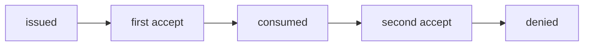
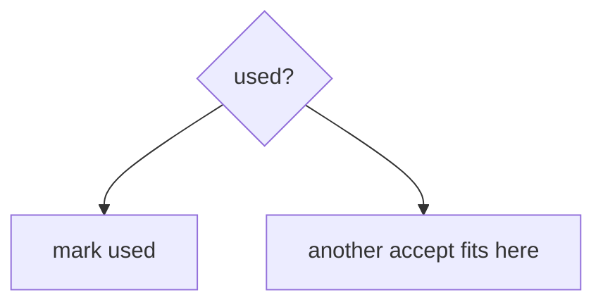

# 6.6-LO-01 — An invite token is a one-shot consume

**Kind:** concept-model
**Loop step:** 1 Property
**Standards:** OWASP ASVS 5.0.0 (final) `v5.0.0-2.3.4`, `v5.0.0-2.3.3`, `v5.0.0-16.5.3`; `v5.0.0-16.5.4` is **Level 3, advanced**. Top 10:2025 A10 is *awareness after* the cause. A unique index is not this sentence until it is the consume.

## The claim this module owns

SecureCollab Phase 1 invite is a **membership workflow**. The token is a capability to join once. Module 2.4 already taught that a retry is not a second grant. This module’s cell is **consume-once** when two tabs or a copied link fire `accept`.

> `accept('t1')` may be true once. The second `accept('t1')` must be false. TOCTOU and retries are the same family.

The forbidden outcome is **an invite token accepted twice**. That is a 1.1 integrity failure of membership: an extra member, or replay after revoke.

ASVS `v5.0.0-2.3.4` wants locking so limited resources cannot be double-booked. `v5.0.0-2.3.3` wants the business operation to succeed entirely or roll back. `v5.0.0-16.5.3` wants fail-secure (no fail-open on validation errors). `v5.0.0-16.5.4` (last-resort error handler) is **Level 3, advanced**.

## Mental model: issued → consumed → dead



The attacker is two tabs, or anyone who copied the token from mail logs (4.3). Trust is local `accept()`. Email is not an authenticator of the recipient (4.2).

**Mechanism (not the property):** a DB unique constraint you never hit, HTTP 400, or “users won’t double-click.”

## Mental model: check-then-set is two steps



Used flag without locking still races. This lab’s oracle is sequential second-accept, which is enough to show the missing consume. A real lock/transaction is the production shape (`v5.0.0-2.3.3` / `v5.0.0-2.3.4`).

## Root cause vs impact vs prevention vs detection vs recovery

| Slice | For this property |
|---|---|
| Root cause | Non-atomic check-then-set; token never marked used |
| Preconditions | second `accept` is true |
| Trigger | Two accepts of `t1` |
| Impact | Integrity of membership workflow |
| Prevention | Consume in the same step; expire; bind to recipient |
| Detection | `invite_replay_denied` |
| Recovery | Remove extra membership; rotate token scheme |

## Framework defaults versus the consume guarantee

A unique constraint helps only if `accept` actually inserts/updates that row. FastAPI does not consume tokens. Fail-open on DB error issues a new membership anyway (`v5.0.0-16.5.3`).

## Mechanism limits

- Sequential consume still races without a lock — named residual.
- Fail-open email errors mint a new token.
- Query-string tokens leak (4.3). Email is phishable (4.2).

## Usability and accessibility

“Link already used” must be announced (WCAG 2.2 4.1.3). Do not hide the error so people retry into a support backdoor that reissues without consume.

## Practice

Draw issued → consumed → dead. Then run:

```
python3 -m pytest labs/6.6/6.6-lab/tests --impl vulnerable
python3 -m pytest labs/6.6/6.6-lab/tests --impl fixed
```

The first command must fail. The second must pass.

## Transfer

Clinic invite-guardian token. Password reset; 2.4 share retry; 7.4 jobs.

## Non-goals

Live race exploits, dumping lab Python into notes. Gates 0–10 and milestones M0–M5 stay **not-attempted**. Answer keys are not in this file.
