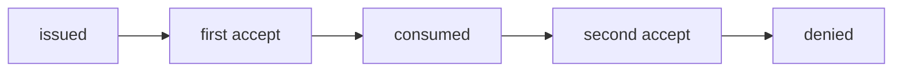
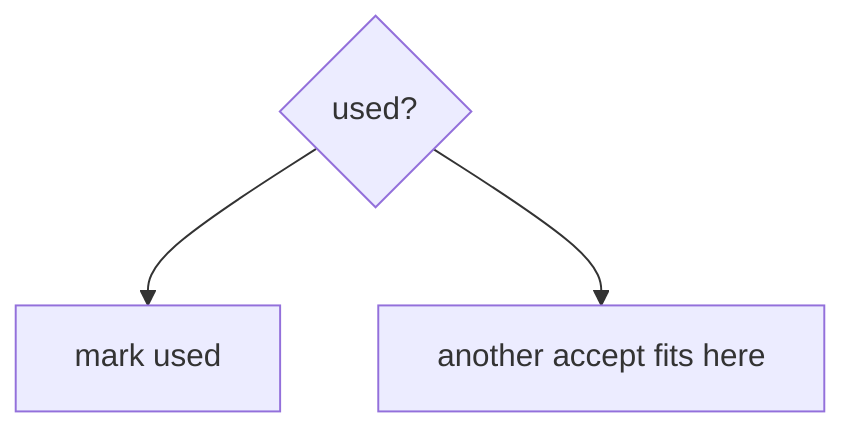

# An invite token is one-shot

**Kind:** concept-model
**Loop step:** 1 Property

## The rule

The notes app invites people with a token. That token is a **join once**. Module 2.4 already taught that a retry is not a second grant. This week's check is **consume-once** when two tabs, or a copied link, both call `accept`.

> `accept('t1')` may be true once. The second `accept('t1')` must be false. A check-then-set race and a retry are the same family: both try to spend the invite again.

So what must not happen: **an invite token accepted twice**. That is an integrity failure of membership. You get an extra member, or a replay after you meant to revoke.

Industry lists ask for locking so a limited seat cannot be booked twice. They want the join to succeed entirely or roll back. They want fail-closed when the store errors. A last-resort error handler is advanced work, not this week's check. A famous-bugs list is awareness after the cause. A unique index is not this sentence until the consume actually writes it.

## Picture: issued, then consumed, then dead



Who could do this: two tabs, or anyone who copied the token from mail logs (4.3). What you trust in this practice: local `accept()`. Email is not proof of who received it (4.2).

**The tool (not the rule):** a database unique constraint you never hit, HTTP 400, or “people will not double-click.”

## Picture: check-then-set is two steps



A used flag without locking still races. This practice’s check is a sequential second accept, which is enough to show the missing consume. A real lock or transaction is the production shape. Sequential consume still races without a lock — name that leftover.

## Why it happens, what it costs, how you stop it, how you notice, how you recover

| Slice | For this rule |
|---|---|
| Why it happens | Check-then-set is not one step; the token is never marked used |
| What has to be true first | A second `accept` still returns true |
| Trigger | Two accepts of `t1` |
| What it costs | Integrity of membership: extra member, or replay after revoke |
| How you stop it | Consume in the same step; expire; bind to the recipient |
| How you notice | `invite_replay_denied` |
| How you recover | Remove the extra membership; rotate the token scheme |

## What the framework does vs what you still have to check

A unique constraint helps only if `accept` actually inserts or updates that row. FastAPI does not consume tokens for you. If the database errors and you still mint a membership, you failed open. The app's promise: `accept('t1')` is true once. The folder is `labs/6.6/6.6-lab`. Fake tokens only. No live mail.

## What the tool cannot do

- Sequential consume still races without a lock — named leftover.
- Fail-open on store or mail errors mints a new token.
- Tokens in the query string leak (4.3). Email is phishable (4.2).

## Can people still use it

“Link already used” must be announced in text a screen reader can speak. Do not hide the error so people retry into a support backdoor that reissues without consume.

## Practice

Draw issued → consumed → dead. Then run:

```text
python3 -m pytest labs/6.6/6.6-lab/tests --impl vulnerable
python3 -m pytest labs/6.6/6.6-lab/tests --impl fixed
```

The first command must fail. The second must pass.

## Use it somewhere new

Clinic invite-guardian token. Password reset. 2.4 share retry. Later job delivery (7.4).

## What this page is not doing

Live race exploits, dumping lab Python into notes. This site does not mark you as finished. Answer keys are not on this site.
