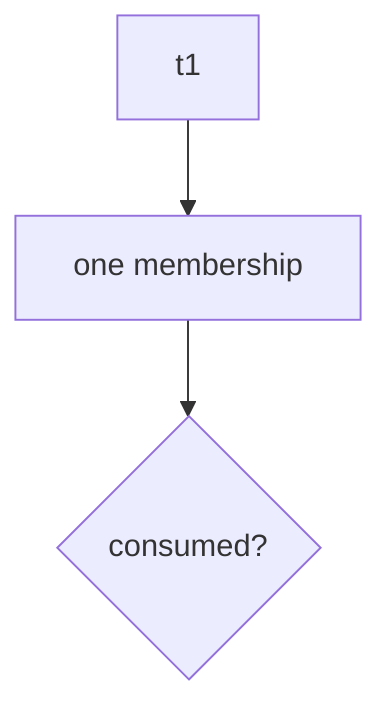
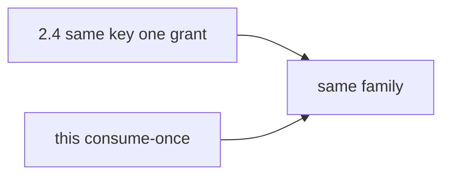

# A consume-once map someone else can test

**Kind:** design-exercise
**Loop step:** 2 Model

## Could someone else name the checks?

“We have a unique index” is not this lesson. A map someone else can test names **states**, **the consume step**, and **fail-closed on store errors**.

This week's freeze: local `accept(token)` / `reset()`. No live mailer.

> `accept('t1')` may be true once. The second `accept('t1')` must be false. If consume is missing from the map, a second join appears.

## Picture: the token is the limited seat

Lock so a limited seat cannot be booked twice. The seat is the invite.

## Picture: 2.4 retry vs this consume

Retry wants **one** success that can be repeated safely. Invite wants **one** success that cannot be repeated.

## Step 1: name the pieces

| Piece | This system |
|---|---|
| Who | invitee; copied-token attacker |
| What | membership slot |
| Actions | `accept` |
| Paths | token string |
| What you trust | used-set consume |
| What you do not trust | extra accepts; store errors |
| Time | issued → consumed |
| The rule | membership stays one join per token |

## Step 2: write allow and deny

| Who | What | Action | Decision |
|---|---|---|---|
| first accept | `t1` | join | allow |
| second accept | `t1` | join | deny |
| first accept | `t2` | join | allow |
| store error | any | join | deny (fail-closed) |

A missing “second accept × `t1` × deny” row is how the invite is accepted twice. Write the hole.

## Practice

Draw the states so someone else could name the checks. Point at `labs/6.6/6.6-lab` file `invite.py`. Your artifact is a versioned list (even a table in your notes) with state, consume, allow or deny, and what would show the deny is false. Fake tokens only.

## Use it somewhere new

Password-reset codes. Later job delivery (7.4). Name the “once.” Do not run those systems here.

## What can still go wrong

Two accepts that both see unused before either writes. Email phishing (4.2). Token in logs (4.3).

## What this page is not doing

Do not run this map against a public clinic or a live mailer. Answer keys are not on this site.
