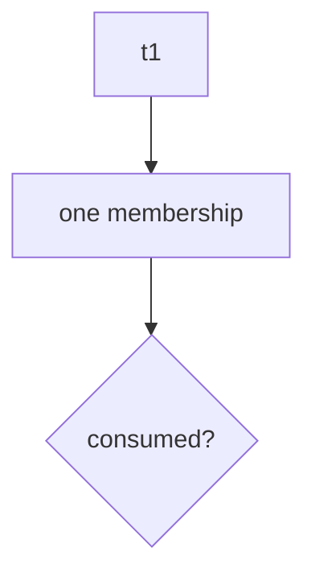
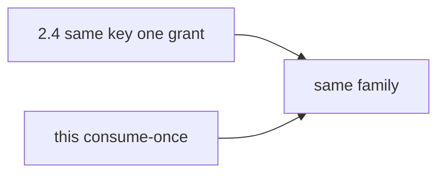

# 6.6-LO-02 — A consume-once map a second engineer can test

**Kind:** design-exercise
**Loop step:** 2 Model
**Standards:** OWASP ASVS 5.0.0 (final) `v5.0.0-2.3.4`.

## Can a second engineer name pytest cases from your state map?

“We have a unique index” is not this lesson. A reviewable model names **states, the consume step, and fail-closed on store errors**.

SecureCollab Phase 1 freeze: local `accept(token)` / `reset()`. No live mailer.

## Mental model: the token is the limited resource

`v5.0.0-2.3.4` theater-seat locking is this shape. The seat is the invite.

## Mental model: 2.4 retry vs 6.6 consume

Retry wants **one** success that can be repeated safely. Invite wants **one** success that cannot be repeated.

## Step 1: freeze pieces

| Piece | This system |
|---|---|
| Subjects | invitee; copied-token attacker |
| Objects | membership slot |
| Actions | `accept` |
| Channels | token string |
| TCB | used-set consume |
| Untrusted | extra accepts; store errors |
| State / time | issued → consumed |
| 1.1 cell | integrity of membership |

## Step 2: write cells

| Subject | Object | Action | Decision |
|---|---|---|---|
| first accept | `t1` | join | allow |
| second accept | `t1` | join | deny |
| first accept | `t2` | join | allow |
| store error | any | join | deny (fail-closed) |

## Practice

Draw the states. Point at `labs/6.6/6.6-lab` file `invite.py`.

## Transfer

Password reset codes; job delivery (7.4).

## Residual risk

TOCTOU without lock; email phishing (4.2); token in logs (4.3).

## Non-goals

Top 10 as the definition of security. Keys stay out of lessons.
