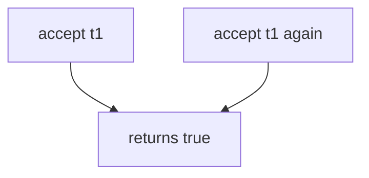

# 6.6-LO-03 — Observe second accept, do not trophy a race

**Kind:** mechanism-lab
**Loop step:** 3 Break
**Standards:** OWASP ASVS 5.0.0 (final) `v5.0.0-2.3.4`.

## Authorized scope

`labs/6.6/6.6-lab` only. Synthetic token `t1`. No live mail, no multi-host races.

**Forbidden outcome:** Invite token accepted twice.

## Mental model: accept always true



The vulnerable tree demonstrates **cause** (token never consumed). Sequential double-accept is enough. Do not build a weaponized race harness.

## What to read in the fixture

`vulnerable/invite.py` returns true every time. `reset()` exists so tests start clean. Tests require first `t1` true, second `t1` false, and a distinct `t2` still able to succeed once on the fixed tree.

## Root cause vs impact

| Slice | Lab |
|---|---|
| Root cause | Token not marked used |
| Impact | Extra membership |
| Not the lesson | A10 as the definition |

## Practice

```
python3 -m pytest labs/6.6/6.6-lab/tests --impl vulnerable
```

Record `test_invite_token_is_single_use`. Do not probe public invite links.

## Transfer

Clinic guardian invite. Predict without leaving this directory.

## Non-goals

No live-target instructions. Synthetic data only.
