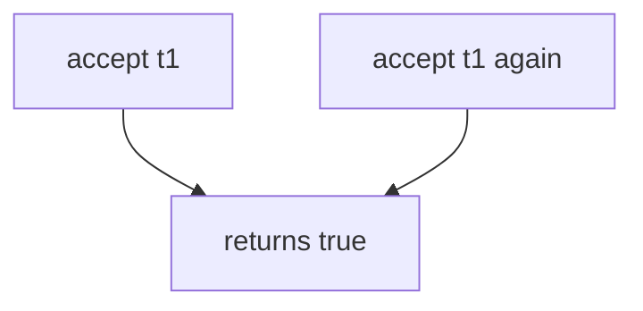

# Practice: an invite token accepted twice

**Kind:** mechanism-lab
**Loop step:** 3 Break

## Try it

The practice is not a website you attack. `accept` returns true and never marks the token used, so a second call is already a second join.

> `accept("t1")` may be true once. The second `accept("t1")` must be false. If it is still true, an invite token was accepted twice.

## Where you may practice

Stay inside `labs/6.6/6.6-lab`. Synthetic tokens `t1` / `t2`. It does not send mail, open two hosts, or touch an employer invite link.

Do not probe public invite links. Do not click a live mail link. Do not build a race harness. You do not need two processes. You must not.

`accept` is supposed to consume the token in the same step that it returns true — not A unique index you never write, HTTP 400 after membership already exists, or “the email proves the recipient”.

Picture two tabs, a copied link, or a retry of the same token — a clinic guardian invite, a password-reset consume, or 2.4’s share retry.

## Picture: accept always true



The token is never consumed. Sequential double-accept is enough. A second true return is already the leak.

Lock so a limited seat cannot be booked twice. The check is sequential consume-once, not a threaded race.

## What to look at: the cause, not a hunt

`vulnerable/invite.py` returns true every time. `reset()` exists so tests start clean. `_used` in the broken files is unused. Tests:

- `test_invite_token_is_single_use` — second `accept("t1")` is false
- `test_distinct_tokens_are_independent` — `t2` still succeeds once on the repaired files


| What you see | What kind of failure | Not the lesson |
|---|---|---|
| `accept` returns true every time | Token never marked used | “We return 400” |
| `_used` unused | Consume is missing | A unique index screenshot |
| Second `t1` still true | Invite accepted twice | A live race harness |

## Why it happens vs what it costs

| Slice | Practice |
|---|---|
| Required rule | Second accept of `t1` is false |
| Why it happens | Token not marked used |
| What's already wrong | `accept` always returns true |
| Trigger | `accept("t1")` then `accept("t1")` |
| What it costs | Integrity of membership; extra member or replay after revoke |
| How you stop it later | Write used in the same step; fail closed on store errors |
| How you notice later | `invite_replay_denied`; never the raw token |
| How you recover later | Keep deny; remove surprise members |
| Out of scope | A famous-bugs list, HTTP 400, or a live race harness |

FastAPI will run `accept` twice if two requests arrive. Postgres unique indexes do nothing until you write the used row. Next.js will happily POST the mail link again. Second `t1` is False.

## Practice

```text
python3 -m pytest labs/6.6/6.6-lab/tests --impl vulnerable
```

Record the failing test `test_invite_token_is_single_use`. Do not probe public invite links. A setup error is not proof the rule holds.

## Use it somewhere new

Clinic guardian invite. Predict, without leaving this directory, whether a second click still joins. Do not click a live mail link.

## What this page is not doing

No live-target instructions. Synthetic tokens only. Sequential double-accept only — no race harness. Do not “fix” the practice by deleting the test.
