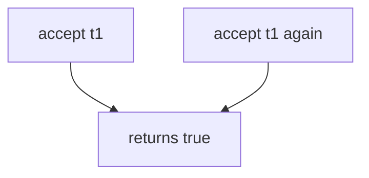

# 6.6-LO-03 — Observe second accept, do not trophy a race

**Kind:** mechanism-lab
**Loop step:** 3 Break
**Standards:** OWASP ASVS 5.0.0 (final) `v5.0.0-2.3.4`. `v5.0.0-16.5.4` is **Level 3, advanced**. Top 10:2025 A10 is awareness after the cause.

## Authorized scope

`labs/6.6/6.6-lab` only. The fixture is an in-process `accept` with synthetic tokens `t1` / `t2`. No live mail, no multi-host races, no employer invite links.

**Forbidden outcome:** invite token accepted twice. Second `accept("t1")` returns true.

Attacker capability in this lab: two tabs, a copied link, or a retry of the same token. That stands in for a clinic guardian invite, a password-reset consume, or 2.4’s share retry. Trust assumption: `accept` is supposed to consume the token in the same step that it returns true. A unique index you never write, HTTP 400 after membership already exists, and “the email proves the recipient” are not in the TCB for this cell.

## Mental model: accept always true



The vulnerable tree demonstrates **cause** (token never consumed). Sequential double-accept is enough. Do not build a weaponized race harness. Preconditions: `accept` returns true every time; `_used` in the vulnerable tree is unused. You do not need two processes. You must not.

ASVS `v5.0.0-2.3.4` wants locking so limited resources cannot be double-booked. This pytest is sequential consume-once, not a threaded trophy.

## What to read in the fixture

`vulnerable/invite.py` returns true every time. `reset()` exists so tests start clean. Tests:

- `test_invite_token_is_single_use`
- `test_distinct_tokens_are_independent` — `t2` still succeeds once on the fixed tree

You do not need a new token string. The failure of `test_invite_token_is_single_use` *is* the evidence.

Do not open the fixed tree yet. Diagnose the cause first.

## Root cause vs impact vs prevention vs detection vs recovery

| Slice | This lab |
|---|---|
| Required property | Second accept of `t1` is false |
| Root cause | Token not marked used |
| Preconditions | `accept` always returns true |
| Trigger | `accept("t1")` then `accept("t1")` |
| Impact | Integrity of membership; extra member or replay after revoke |
| Prevention | Write used in the same step; fail closed on store errors |
| Detection | `invite_replay_denied`; never the raw token |
| Recovery | Keep deny; remove surprise members |
| Not the lesson | A10, HTTP 400, or a live race harness |

## Framework defaults versus the consume guarantee

FastAPI will run `accept` twice if two requests arrive. Postgres unique indexes do nothing until you write the used row. Next.js will happily POST the mail link again. The application guarantee is: **this** fixture, second `t1` is False.

## Practice

```text
python3 -m pytest labs/6.6/6.6-lab/tests --impl vulnerable
```

Record `test_invite_token_is_single_use`. Do not probe public invite links. An environment error is not security evidence.

## Transfer

Clinic guardian invite. Predict without leaving this directory. Do not click a live mail link.

## Non-goals

No live-target instructions. Synthetic tokens only. Sequential double-accept only — no race harness.
