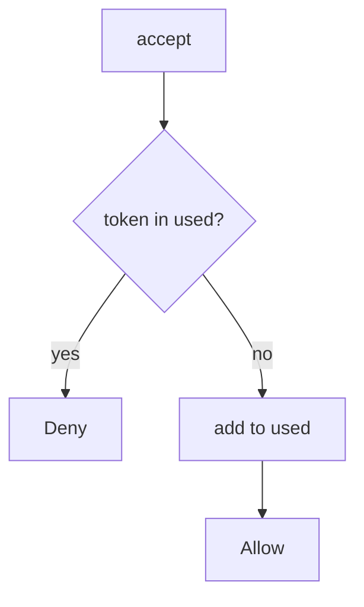

# 6.6-LO-04 — Mark the token used in the same step

**Kind:** design-exercise
**Loop step:** 4 Build
**Standards:** OWASP ASVS 5.0.0 (final) `v5.0.0-2.3.4`, `v5.0.0-2.3.3`. `v5.0.0-16.5.3` wants fail-secure. `v5.0.0-16.5.4` is **Level 3, advanced**.

## Structural means consume is the accept

`accept` must record `t1` as used when it returns true. The next call denies. Structural means that consume — not a unique index you never write, not HTTP 400 after the membership already exists, not “we emailed them.”

The smallest restore for SecureCollab Phase 1 invite is: write used, then allow once. Fail-safe: store errors **deny** (`v5.0.0-16.5.3`). Production uses a transaction (`v5.0.0-2.3.3`) so add-and-membership commit together. Do not fail open because the DB was unreachable.

## Mental model: write used, then allow once



The lab’s fixed tree is a `set` of consumed tokens. Production still needs a lock for true concurrent accepts (`v5.0.0-2.3.4`) — named TOCTOU residual, not this sequential pytest. Token-in-query is 4.3. Email as recipient authenticator is 4.2. Password reset and 7.4 jobs are the same family with different “once” meanings.

ASVS `v5.0.0-2.3.4` wants no double-booking. This pytest is that sentence for sequential `accept`.

## Why this restores the cell

| After the fix | Must be true |
|---|---|
| first `t1` | true |
| second `t1` | false |
| first `t2` | true |
| second `t2` | false |

## What this is not

Used flag without locking (named TOCTOU residual). Fail-open on DB error. Token in query logs (4.3). Email as recipient authenticator (4.2). HTTP 400 as consume. A10 as the finding title.

## Mechanism limits

- Two concurrent accepts without a lock can both see “unused.”
- Fail-open on store errors (`v5.0.0-16.5.3`) re-opens the cell.
- Last-resort handler (`v5.0.0-16.5.4` Level 3 advanced) is not this fixture.
- Phishable mail (4.2) still delivers the first consume to the wrong person.
- Magic-link standing session is 4.3 / this cell’s URL residual.

## Practice

Name the predicate (first true ∧ second false per token). Run:

```text
python3 -m pytest labs/6.6/6.6-lab/tests --impl fixed
```

Must pass.

## Transfer

Clinic: stop treating “link clicked” as unlimited joins; consume in the store.

## Residual risk

True concurrent accepts without a lock; Level 3 last-resort handler; phishable mail; token in URL.

## Non-goals

Do not build a race harness. Do not claim Gate 6 from a unique-index screenshot.
