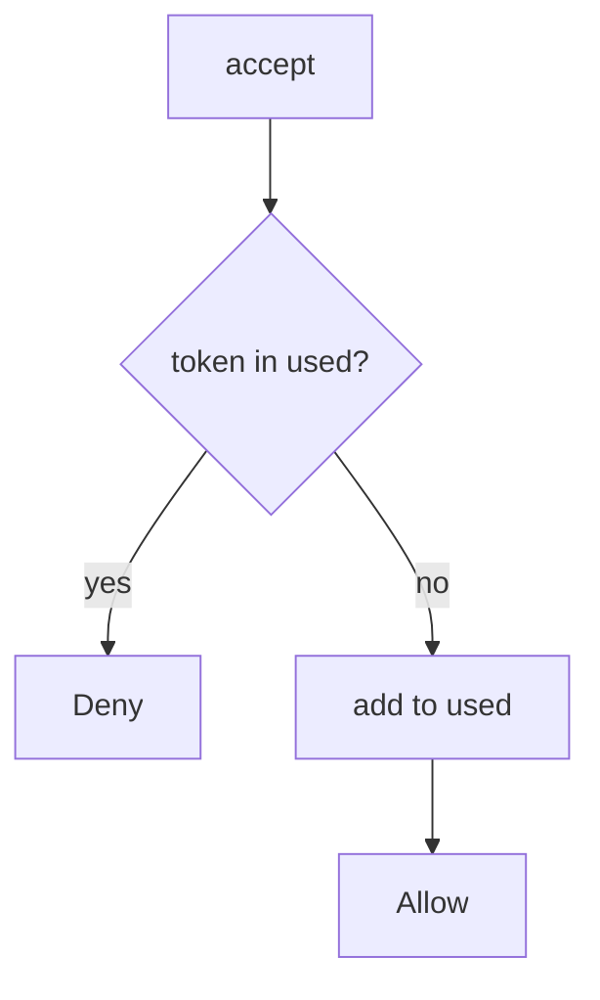

# Mark the token used in the same step

**Kind:** design-exercise
**Loop step:** 4 Build

## The rule

A unique index you never write is not the fix. HTTP 400 after the membership already exists is not the fix. “We emailed them” is not the fix.

The structural change is: `accept` **records `t1` as used when it returns true**. The next call denies. Consume is the accept. Same step. Not a follow-up ticket.

The smallest fix for a invite is: write used, then allow once. Fail closed: store errors **deny**. Do not fail open because the database was unreachable. Production uses a transaction so the used-write and the membership commit together.

## Picture: write used, then allow once



The repaired files use a `set` of consumed tokens. Production still needs a lock for true concurrent accepts — named leftover, not this sequential check. Token in the query string is 4.3. Email as proof of the recipient is 4.2. Password reset and later jobs (7.4) are the same family with different “once” meanings.

There should be no double-booking — sequential `accept`.

## What the repaired files must show

Do not treat `fixed/invite.py` as a production invite store.

| After the fix | Must be true |
|---|---|
| first `t1` | true |
| second `t1` | false |
| first `t2` | true |
| second `t2` | false |

Fail closed: if you cannot ask the store, the answer is no. Uncertainty is a **deny**, not a yes because the mailer still showed “clicked.”

## What this is not

- Used flag without locking (named leftover: two accepts that both see unused).
- Fail-open on database error.
- Token in query logs (4.3).
- Email as recipient authenticator (4.2).
- HTTP 400 as consume.
- A famous-bugs list as the finding title.

## What the tool cannot do

- Two concurrent accepts without a lock can both see “unused.”
- Fail-open on store errors re-opens the hole.
- A last-resort error handler is advanced work, not this practice.
- Phishable mail (4.2) still delivers the first consume to the wrong person.
- A magic-link that stays a standing session is 4.3 — this check owns consume, not the cookie exchange.

## Can people still use it

If you show “link already used,” say it in text a screen reader can speak. Do not encode used as color only. The announcement is not the consume.

## Practice

Name the check (first true and second false per token). Run:

```text
python3 -m pytest labs/6.6/6.6-lab/tests --impl fixed
```

## Use it somewhere new

Stop treating “link clicked” as unlimited joins; consume in the store.

## What can still go wrong

True concurrent accepts without a lock. Fail-open on store errors. Phishable mail. Token in the URL. A last-resort handler is not this check.
