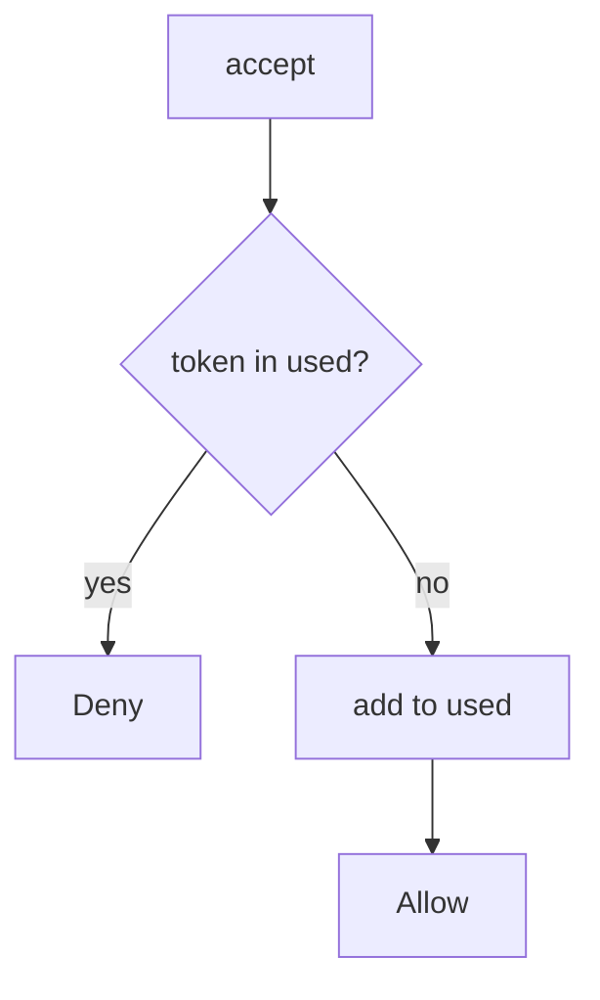

# 6.6-LO-04 — Mark the token used in the same step

**Kind:** design-exercise
**Loop step:** 4 Build
**Standards:** OWASP ASVS 5.0.0 (final) `v5.0.0-2.3.4`, `v5.0.0-2.3.3`.

## Structural means consume is the accept

`accept` must record `t1` as used when it returns true. The next call denies. Structural means that consume — not a unique index you never write, not HTTP 400 after the membership already exists.

## Mental model: write used, then allow once



Fail-safe: store errors **deny** (`v5.0.0-16.5.3`). Production uses a transaction (`v5.0.0-2.3.3`) so add-and-membership commit together.

## Why this restores the cell

| After the fix | Must be true |
|---|---|
| first `t1` | true |
| second `t1` | false |
| first `t2` | true |

## What this is not

Used flag without locking (named TOCTOU residual). Fail-open on DB error. Token in query logs (4.3). Email as recipient authenticator (4.2).

## Practice

Name the predicate. Run:

```
python3 -m pytest labs/6.6/6.6-lab/tests --impl fixed
```

Must pass.

## Transfer

Clinic: stop treating “link clicked” as unlimited joins.

## Residual risk

True concurrent accepts without a lock; `v5.0.0-16.5.4` Level 3 last-resort handler; phishable mail.
