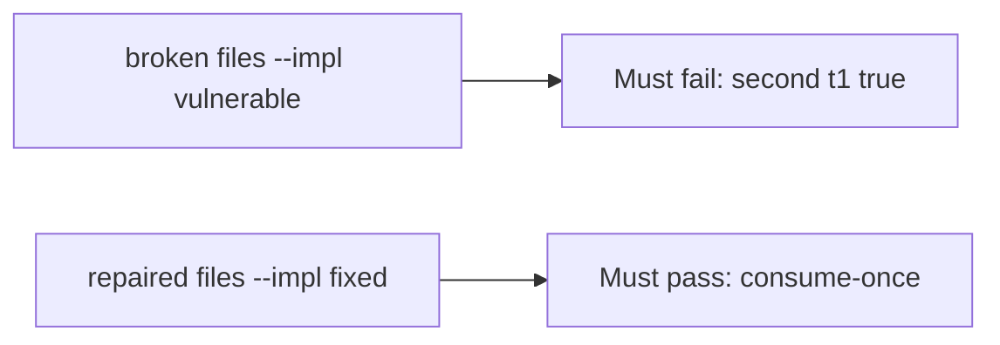

# Using the same token a second time must fail

**Kind:** verification-lab
**Loop step:** 5 Verify

## Check it

A unique index you never write does not stop the second join. Returning 400 after the row exists is late. First `accept("t1")` has to be true and the second `accept("t1")` has to be false. On the broken files the helper still returns true the second time. On the repaired files it does not.

## Picture: second t1 must fail the check

A grep for `UNIQUE` in a migration can still hide that `accept("t1")` is still true twice.



If both pass, you are not looking at the second `t1`. The first accept of `t1` may pass on both sides. You still have to deny the second accept.

## What the check has to show

| Mode | Must show for this topic |
|---|---|
| Normal | first `t1` allowed; distinct `t2` allowed once |
| Wrong input / abuse | second `t1` denied; broken files must fail |
| Failure | store error denies (named in review; fail-closed smell) |
| Not claimed | threaded race; mail delivery; lock semantics |

The test `test_invite_token_is_single_use` is there so a second true still fails. Sequential calls are enough; do not add a race harness.

A `UNIQUE` keyword is not two `accept("t1")` calls. This practice never opens a live mailer.

```text
python3 -m pytest labs/6.6/6.6-lab/tests --impl vulnerable
python3 -m pytest labs/6.6/6.6-lab/tests --impl fixed
```

Map the test to the second-`t1` deny row you wrote. If the broken files do not fail the second `t1`, the lab is miswired — fix the wiring, not the assertion. A setup error is not proof the rule holds.

## What the tests do not prove

- Atomic lock under threads (production shape)
- Transaction rollback
- Fail-open on errors, except as a named review smell
- Last-resort error handler (advanced; not this check)
- Mail delivery or recipient authenticity (4.2)

## Practice

Do not treat a grep for `UNIQUE` in a migration as the check. Call `accept("t1")` twice.

## Use it somewhere new

Clinic guardian invite. Asserting HTTP 200 on `/accept` is not this check (see 9.3). Do not run a test that clicks a live mail link.

## What this page is not doing

Do not add a live race harness. Do not log tokens. Answer keys are not on this site.
