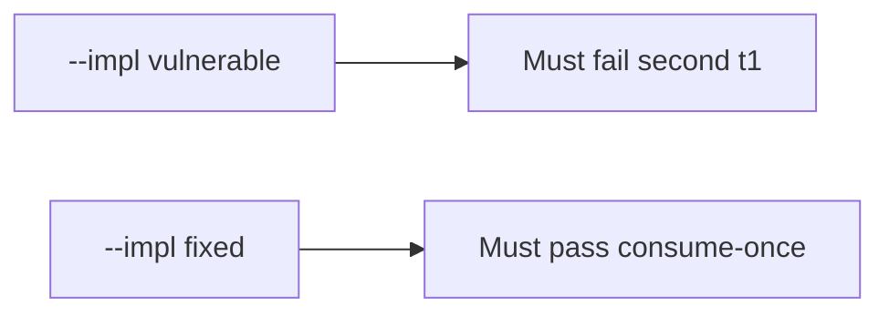

# 6.6-LO-05 — Evidence is second-accept false, then a passing pair

**Kind:** verification-lab
**Loop step:** 5 Verify
**Standards:** OWASP ASVS 5.0.0 (final) `v5.0.0-2.3.4`.

## An invariant that cannot fail a test is still a slogan

“Unique constraint exists” is not evidence. The oracle is the local pair.

## Mental model: vulnerable must fail: second t1

The failing observation on `--impl vulnerable` is **second t1**. A passing collection count is not this cell.



| Case | Must show |
|---|---|
| Negative / abuse | second `t1` denied |
| Normal | first `t1` allowed; distinct `t2` allowed once |
| Not claimed | threaded race; mail delivery; lock semantics |

```
python3 -m pytest labs/6.6/6.6-lab/tests --impl vulnerable
python3 -m pytest labs/6.6/6.6-lab/tests --impl fixed
```

First accept of `t1` may pass on both.

## What the tests do not prove

- Atomic lock under threads (`v5.0.0-2.3.4` production shape)
- Transaction rollback (`v5.0.0-2.3.3`)
- Fail-open on errors (`v5.0.0-16.5.3`) except as a named review smell
- Last-resort handler Level 3 (`v5.0.0-16.5.4`)

## Practice

Execute both implementations. Map each test to an LO-02 cell.

## Transfer

Clinic guardian invite. A test that only asserts HTTP 200 on `/accept` is not this cell.
