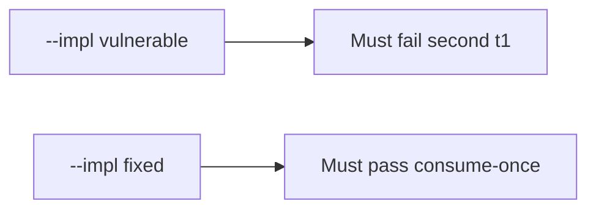

# 6.6-LO-05 — Evidence is second-accept false, then a passing pair

**Kind:** verification-lab
**Loop step:** 5 Verify
**Standards:** OWASP ASVS 5.0.0 (final) `v5.0.0-2.3.4`.

## An invariant that cannot fail a test is still a slogan

“Unique constraint exists” is not evidence. “We return 400” is a mechanism observation. The oracle is: first `accept("t1")` is true and second `accept("t1")` is false. That second observation must be **false** on `--impl vulnerable` (returns true) and **true** on `--impl fixed`.

## Mental model: vulnerable must fail: second t1

The failing observation on `--impl vulnerable` is **second t1**. A passing collection count is not this cell.



| Mode | Must show for this module |
|---|---|
| Negative / abuse | second `t1` denied; vulnerable must fail |
| Normal | first `t1` allowed; distinct `t2` allowed once |
| Not claimed | threaded race; mail delivery; lock semantics |

Lab tests in `labs/6.6/6.6-lab/tests/test_property.py`. `test_invite_token_is_single_use` is a **forbidden-outcome** test: a second true is not allowed to count as a passing control. Sequential calls are enough; do not add a race harness.

```text
python3 -m pytest labs/6.6/6.6-lab/tests --impl vulnerable
python3 -m pytest labs/6.6/6.6-lab/tests --impl fixed
```

First accept of `t1` may pass on both implementations. That does not excuse the second-accept test. If vulnerable does not fail the second `t1`, the lab is miswired—fix the wiring, not the assertion.

## What the tests do not prove

- Atomic lock under threads (`v5.0.0-2.3.4` production shape)
- Transaction rollback (`v5.0.0-2.3.3`)
- Fail-open on errors (`v5.0.0-16.5.3`) except as a named review smell
- Last-resort handler Level 3 (`v5.0.0-16.5.4`)
- Mail delivery or recipient authenticity (4.2)

Record those as residuals or later modules, not as silent passes.

## Practice

Execute both implementations this session. Write the fail/pass pair next to the matrix row. Reject a “test” that only greps `UNIQUE` in a migration without calling `accept("t1")` twice.

## Transfer

Clinic guardian invite. A test that only asserts HTTP 200 on `/accept` is not this cell (see 9.3). A test that clicks a live mail link is out of scope.

## Non-goals

Do not add a live race harness. Do not log tokens. Keys stay out of this file.
