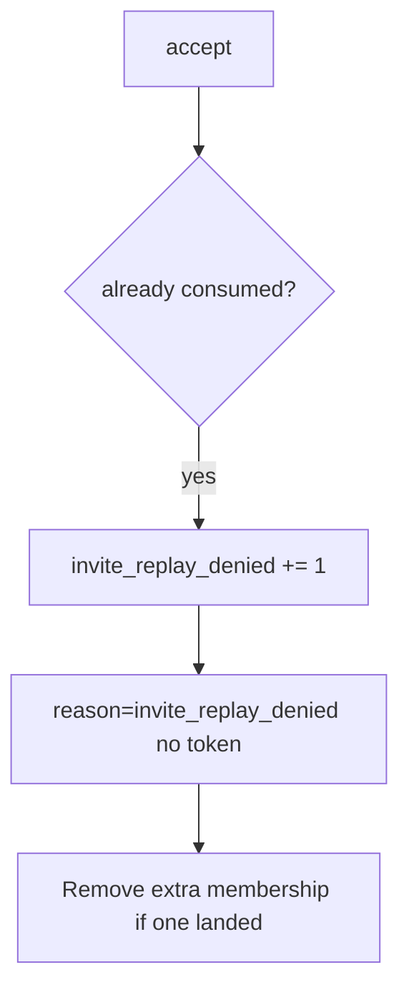

# 6.6-LO-06 — Detect invite_replay_denied

**Kind:** operations-exercise
**Loop step:** 6 Operate
**Standards:** NIST CSF 2.0 (final) DE/RS/RC as outcome labels; OWASP ASVS 5.0.0 (final) `v5.0.0-2.3.4`. CSF names outcomes; it does not consume the token.

## Prevention is not absolute

A new accept route can skip consume after `accept` was “fixed once.” Pair detect and recover. Do not log tokens (4.3) or email addresses as if they were public ids. Do not paste the mail link into the ticket.

## Mental model: second accept is a signal



| Outcome | This module |
|---|---|
| Detect | `invite_replay_denied` |
| Signal | request id, invite id; never the raw token |
| Recover | Keep deny; remove surprise members; rotate token scheme if leaked |
| Residual | Email phishing (4.2) |

CSF 2.0 Detect / Respond / Recover name outcomes. They do not prove `v5.0.0-2.3.4`. A SIEM product name is not the property. Re-run `test_invite_token_is_single_use` after any accept-route change; a green “unique index” tile is not that pytest. Password-reset consume is another path of the same family — inventory it before claiming Recover.

## Framework defaults versus the operate guarantee

A mail vendor dashboard will show “link clicked once” and stay silent when `/accept` still returns true the second time. Detection must observe **second `accept` false**, not a click counter. If the alert includes the raw token, you have opened a 4.3 cell.

## Practice

Write one log line you would accept. Tie it to `labs/6.6/6.6-lab`.

```text
log_denied reason=invite_replay_denied invite_id=inv_66a request_id=req_66a
```

Reject any line that includes the token, a note body, or a real email.

## Transfer

Clinic: detect guardian-invite replays; do not paste the mail link into the ticket. Do not click a live invite.

## Usability

If a human sees “link already used,” announce it (WCAG 2.2 Success Criterion 4.1.3). A silent retry loop looks like a broken link and pushes people to share the token (4.2).

## Non-goals

A SIEM product name is not the property. Live invite replay is out of scope. Gates 0–10 stay not-attempted.
