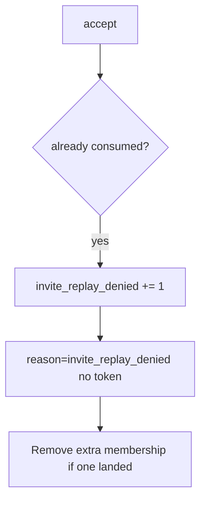

# 6.6-LO-06 — Detect invite_replay_denied

**Kind:** operations-exercise
**Loop step:** 6 Operate
**Standards:** NIST CSF 2.0 (final) DE/RS/RC as outcome labels; OWASP ASVS 5.0.0 (final) `v5.0.0-2.3.4`.

## Prevention is not absolute

A new accept route can skip consume. Pair detect and recover. Do not log tokens (4.3) or email addresses as if they were public ids.

## Mental model: second accept is a signal



| Outcome | This module |
|---|---|
| Detect | `invite_replay_denied` |
| Signal | request id, invite id; never the raw token |
| Recover | Keep deny; remove surprise members; rotate token scheme if leaked |
| Residual | Email phishing (4.2) |

## Practice

Write one log line you would accept. Tie it to `labs/6.6/6.6-lab`.

```
log_denied reason=invite_replay_denied invite_id=inv_66a request_id=req_66a
```

Reject any line that includes the token, a note body, or a real email.

## Transfer

Clinic: detect guardian-invite replays; do not paste the mail link into the ticket.

## Non-goals

A SIEM product name is not the property.
