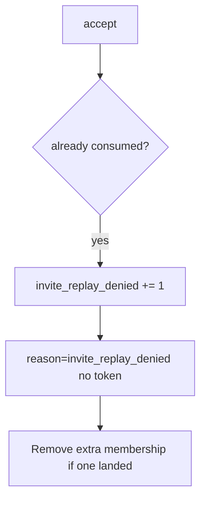

# Notice invite_replay_denied

**Kind:** operations-exercise
**Loop step:** 6 Operate

## Stopping it is not enough

Even after `accept` was fixed once, a new accept route can skip consume. Running it for real is the rest of the loop: notice, keep deny, remove a surprise member, and refuse to “help” by logging the token.

Do not log tokens (4.3) or email addresses as if they were public ids. Do not paste the mail link into the ticket.

## Picture: second accept is a signal

A second accept after consume is a notice-and-recover problem, not a licence to quote the token in the paging channel. Notice names the event. Recover removes the extra membership. Neither reprints the token.



Noticing, responding, and recovering still need an owner. They do not pick a log product. They do not consume the token.

## Signals that do not become a second leak

| Outcome | This topic |
|---|---|
| Notice | `invite_replay_denied` |
| What the line holds | request id, invite id — **never** the raw token |
| Respond | Keep deny; stop the route that skipped consume |
| Recover | Remove surprise members; rotate the token scheme if leaked; re-run `test_invite_token_is_single_use` |
| Leftover | Email phishing (4.2) |

A log line a reviewer can accept looks like:

```text
log_denied reason=invite_replay_denied invite_id=inv_66a request_id=req_66a
```

Not: the token, a note body, a real email, or “the mailer said clicked once.”

If your alert includes the raw token, you have opened a 4.3 hole in the paging channel.

A green “unique index” tile is not that check. A mail vendor dashboard will show “link clicked once” and stay silent when `/accept` still returns true the second time. Detection must observe **second `accept` false**, not a click counter. Password-reset consume is another path of the same family — inventory it before claiming recover.

## What the framework does vs what you still have to check

A mailer dashboard is not consume. FastAPI does not emit `invite_replay_denied` for you. Re-run `test_invite_token_is_single_use` after any accept-route change.

## Can people still use it

If a human sees “link already used,” announce it in text a screen reader can speak. A silent retry loop looks like a broken link and pushes people to share the token (4.2).

## Practice

Write one log line you would accept in review (ids, reason, no token). Tie it to `labs/6.6/6.6-lab`. Reject any line that includes the token, a note body, or a real email.

## Use it somewhere new

A clinic example: notice guardian-invite replays; do not paste the mail link into the ticket. Do not click a live invite.

## What this page is not doing

A vendor name is not this week's rule. Live invite replay is out of scope. This site does not mark you as finished. Answer keys are not on this site.
