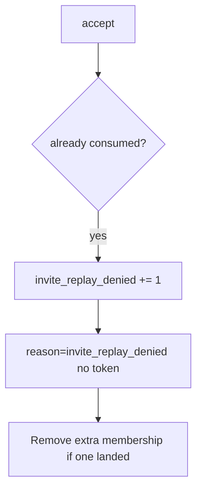

# Notice invite_replay_denied

**Kind:** operations-exercise
**Loop step:** 6 Operate

## Fixing it once is not enough

A new accept route can skip consume after the token lives in a `set`. Notice the second join, keep the deny, remove a surprise member, and do not log the token.

Keep tokens, email addresses, and the mail link out of the ticket.

## Picture: second accept is a signal

If a second accept lands after consume, keep the token out of the pager. Then remove the extra membership.



A log product does not consume the token.

## Signals that do not become a second leak

| Outcome | This topic |
|---|---|
| Notice | `invite_replay_denied` |
| What the line holds | request id, invite id — **never** the raw token |
| Respond | Keep deny; stop the route that skipped consume |
| Recover | Remove surprise members; rotate the token scheme if leaked; re-run `test_invite_token_is_single_use` |
| Leftover | Email phishing (4.2) |

```text
log_denied reason=invite_replay_denied invite_id=inv_66a request_id=req_66a
```

The mailer secret is sitting in the sample if it still holds the token, a note body, a real email, or “the mailer said clicked once.”

Putting the raw token in the alert opens a 4.3 hole in the pager.

A unique-index screenshot does not consume the token. A mail vendor dashboard will show “link clicked once” and stay silent when `/accept` still returns true the second time. Detection must observe **second `accept` false**, not a click counter. Password-reset consume is another once-token; the seat is not taken until that path is named.

## What the framework does vs what you still have to check

A mailer dashboard is not consume. FastAPI does not emit `invite_replay_denied` for you. A second join still has to fail `test_invite_token_is_single_use`.

## Can people still use it

If a human sees “link already used,” announce it in text a screen reader can speak. A silent retry loop looks like a broken link and pushes people to share the token (4.2).

## Practice

Log ids and a reason for the second accept — never the token. The token, a note body, or a real email would dump the mailer secret onto the second-accept line.

## Use it somewhere new

Notice guardian-invite replays; do not paste the mail link into the ticket. Do not click a live invite.

## What this page is not doing

Do not use live invite replay. This site does not mark you as finished. Answer keys are not on this site.
