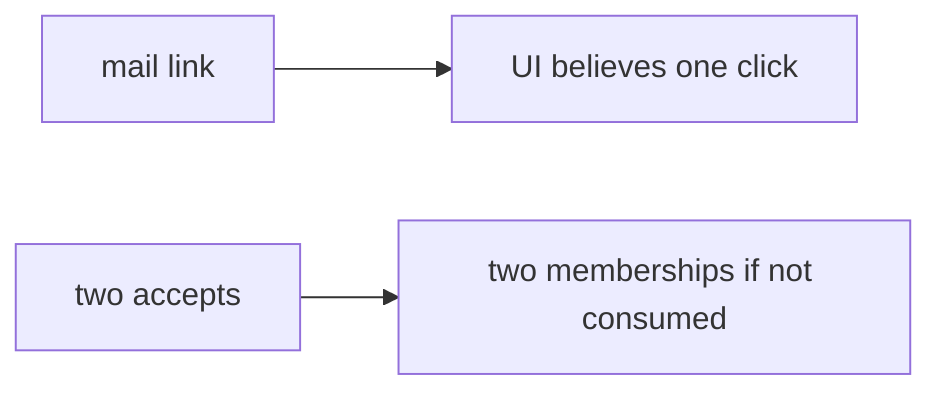

# Same idea on a clinic invite-guardian token

**Kind:** transfer-challenge
**Loop step:** 7 Transfer

## Use it somewhere new

The notes-app scaffolding goes away. You get a **clinic invite-guardian token**. An “add guardian” mail link always returns 200. Your job is to rewrite the loop, not to name a bug-list code.

The notes-app sentence was: second `accept('t1')` must be false. Rewrite it for a clinic without changing the fork: consume-once, first true, second false.

Also name password reset, 2.4 share retry, and later jobs (7.4) as the same family with different “once” meanings.

## Picture: guardian invite is still a limited seat

Renaming “t1” to “guardian” is not transfer. The leftover changes. A click counter is not consume. FastAPI, a unique-index screenshot, and “we emailed the guardian” do not consume.

| Notes app this week | Clinic sketch |
|---|---|
| `t1` invite token | Guardian mail-link token |
| `accept` | Join analogue |
| second `accept` false | Second click must not add another guardian |
| Two tabs / copied link | Two clicks / copied link — **not** a live clinic |
| Password reset; 2.4 retry; 7.4 jobs | Same family — name the “once,” do not run them here |

If the mail link always returns 200 and never writes used, the hole is open. A magic-link that stays a standing session is 4.3 — exchange it for a cookie; this week's check owns consume. Adding a unique index without a second-accept test leaves `accept` always true. The local pytest analogue is `test_invite_token_is_single_use` — on a practice, not a live mail link.

## Prompt — clinic invite-guardian

Rewrite the notes-app sentence. Include:

1. who can act (two clicks or a copied link — **not** a live clinic);
2. what you trust (consume in the store is trusted; HTTP 400 is not);
3. what must not happen (second `accept` true, not a legal label);
4. a test idea on **local** files only (first true, second false — never on the real clinic);
5. leftover (two accepts that both see unused; fail-open; token in URL; phishing; last-resort error handler is advanced);
6. whether a human-read “link already used” status must not use color as the only cue.

## What is not good enough

| Reject | Why |
|---|---|
| “We return 400” | Error page is not consume |
| Live clinic probe | Course rules |
| A famous-bugs list as the rule | Awareness after the cause |
| HTTP 200 as consume evidence | Wrong observation |
| Unique index without a write | Tool theater |

## Practice

One page. No answer keys. The only running system you may break is `labs/6.6/6.6-lab`. Do not click a live invite.

## What this page is not doing

Live-target races. Real invite tokens. Claiming a course gate from this page.
