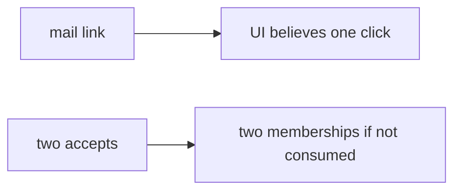

# 6.6-LO-07 — Transfer: clinic invite-guardian token

**Kind:** transfer-challenge
**Loop step:** 7 Transfer
**Standards:** OWASP ASVS 5.0.0 (final) `v5.0.0-2.3.4`. Top 10 A10 is awareness after.

## Change the workplace; keep consume-once

Do not answer with a Top 10 / CWE / scanner as the definition of security.

**Prompt:** Clinic invite-guardian token. Also name password reset, 2.4 share retry, and 7.4 jobs as the same family with different “once” meanings.

**Product sketch:** EHR-lite “add guardian” mail link that always returns 200.

Rewrite the SecureCollab sentence. Include:

1. attacker capabilities (two clicks or a copied link — not a live clinic);
2. trust assumptions (consume in the store is TCB; HTTP 400 is not);
3. forbidden outcome (second `accept` true, not “HIPAA”);
4. a test idea on a **local** fixture only;
5. residual (TOCTOU without lock; fail-open; token in URL; phishing; Level 3 last-resort handler);
6. WCAG if a human “link already used” path is in the claim (announced status, not a silent retry loop).

## Mental model: guardian invite is still a limited seat

## What graders reject

| Reject | Why |
|---|---|
| “We return 400” | Error page is not consume |
| Live clinic probe | Lab policy |
| A10 as the property | Awareness after the cause |

## Practice

One page. No keys. `labs/6.6/6.6-lab` is the only running system you may break.
