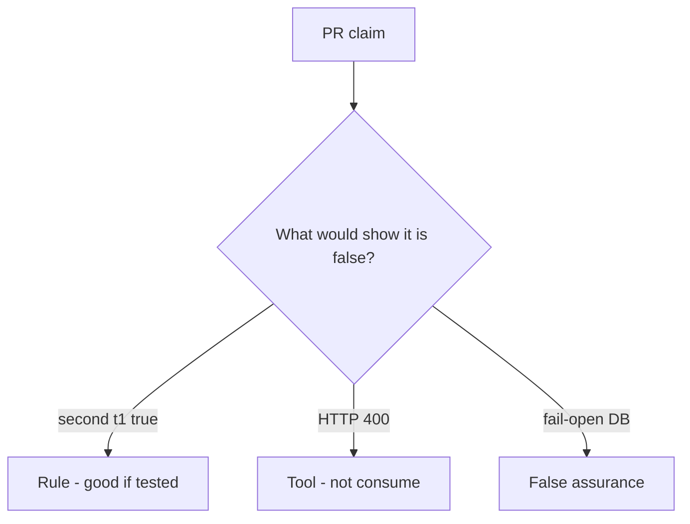

# Review of always-true accept

**Kind:** code-review
**Loop step:** Review

The answers are not on this page. Do not open the keys file until someone has looked at your review.

## What you are reviewing

A colleague ships notes-app invite. Your job is to label each claim **rule**, **tool**, or **false assurance**, and to say whether second `accept("t1")` is still true if they ship. Start at consume-once, not at a scanner color or a mailer ticket.

The folder `labs/6.6/6.6-lab/vulnerable/` is the change. The check you already ran (`test_invite_token_is_single_use`) is the rule test. A comment “will consume later” is not.

## Picture: problems to find (name them yourself)

**`accept` always true**. Label it rule, tool, or false assurance before you accept the change.

What has to stay true: second accept false. If that call never includes a used-write, that replay path is still open. HTTP 400 after membership already exists is still the same problem.

A unique index that is never written still leaves `accept` always true. Password-reset consume is the same family — name it as leftover, do not skip `test_invite_token_is_single_use`.

## Problems to find (name them yourself)

- `accept` always true
- No unique constraint / no used write
- Fail-open on database error
- Token in query logs (4.3)

Also reject: live race harnesses; closing findings without re-running `test_invite_token_is_single_use`; keys in learner notes; real people's data in the practice files; live invite links in the review notes.

## Common mix-ups

- 400 errors are fail-safe
- Email links prove who received them
- Races are only performance
- A famous-bugs list is the rule
- A unique-index screenshot is consume

## Practice

Write three review notes a maintainer could act on. Each note: what you saw, rule or false assurance, suggested structural change, leftover you will **not** delete. Tie at least one note to `test_invite_token_is_single_use`. Do not open the keys file.

## Use it somewhere new

Clinic change that “added a unique index” without a second-accept test is an incomplete review of consume. Name the independent falsehood that would still keep the second `t1` from succeeding.

## Can people still use it

If the dashboard shows “link already used,” do not encode it as color only. That is a cue for people, not the consume.

## What this page is not doing

Do not merge by adding a comment “will consume later.” That comment is leftover without an owner. Do not click a live invite to prove the finding.
