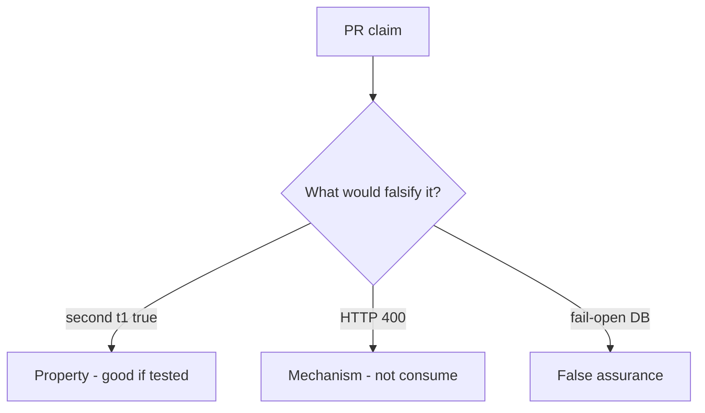

# 6.6-LO-08 — Review always-true accept as a PR, not an A10 ticket

**Kind:** code-review
**Loop step:** Review
**Standards:** OWASP ASVS 5.0.0 (final) `v5.0.0-2.3.4`.

## Review the fixture as if it were SecureCollab invite

Review `labs/6.6/6.6-lab/vulnerable/` as a SecureCollab PR. Your job is not to count suspicious lines. Reconstruct whether second `accept("t1")` is still true, compare that with the module invariant, and write changes a developer can verify.

Intended findings live only in `content/assessment/keys/6.6.md` — not here. Do not open the keys file until your review has been evaluated.

## Mental model: accept always true on the PR

Start with this seeded smell: **`accept` always true**. Label it property, mechanism, or false assurance before you accept the PR.

Classification starts at the protected effect (second accept false). Everything that is not a used-write at that call is a candidate replay path. HTTP 400 after membership already exists is the same smell, not a different finding class.

A unique index that is never written still leaves `accept` always true. Password-reset consume is the same family — name it as residual, do not skip `test_invite_token_is_single_use`.

## Seeded smells (label them yourself)

- `accept` always true
- No unique constraint / no used write
- Fail-open on DB error
- Token in query logs (4.3)

Also reject: live race harnesses; closing findings without re-running `test_invite_token_is_single_use`; keys in lessons.

## Misconceptions this module refuses

- 400 errors are fail-safe
- Email links are authenticators of the recipient
- Races are only performance
- A10 is the property
- Unique index screenshot is consume

## Practice

Write three review notes a maintainer could act on. Each note: observation, property or false assurance, suggested structural change, residual you will **not** delete. Tie at least one to `test_invite_token_is_single_use`.

## Transfer

Clinic PR that “added a unique index” without a second-accept test is an incomplete mediation review. Name the independent falsehood that would still keep the second `t1` from succeeding.

## Non-goals

Do not merge by adding a comment “will consume later.” That comment is a residual without an owner. Do not click a live invite to prove the finding.
