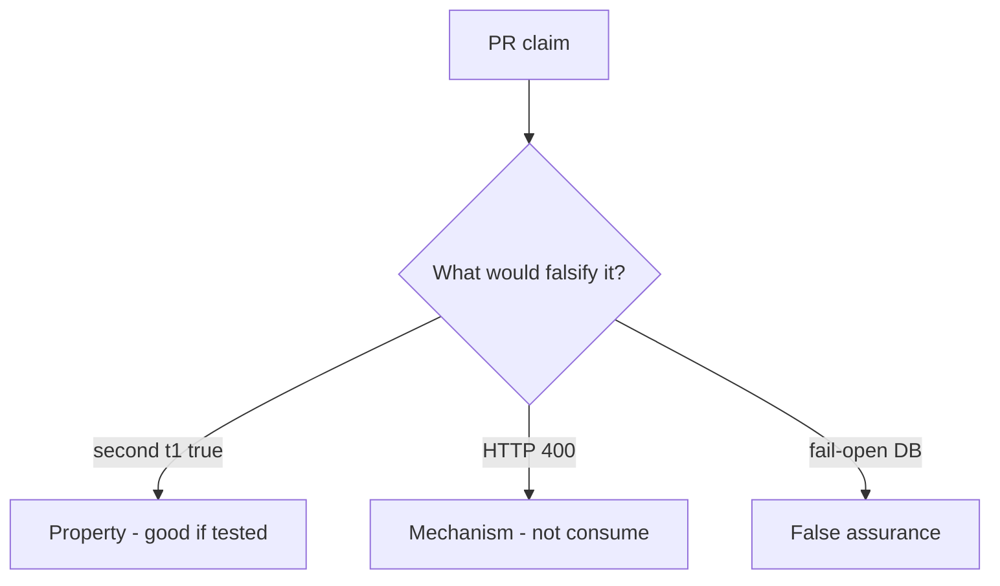

# 6.6-LO-08 — Review always-true accept as a PR, not an A10 ticket

**Kind:** code-review
**Loop step:** Review
**Standards:** OWASP ASVS 5.0.0 (final) `v5.0.0-2.3.4`.

## Review the fixture as if it were SecureCollab invite

Review `labs/6.6/6.6-lab/vulnerable/` as a SecureCollab PR. Intended findings live only in `content/assessment/keys/6.6.md` — not here.

## Mental model: property, mechanism, or false assurance

Seeded smells (label them yourself; do not open the keys file):

- `accept` always true
- No unique constraint / no used write
- Fail-open on DB error
- Token in query logs (4.3)

Also reject: live race harnesses, keys in lessons.

## Misconceptions

- 400 errors are fail-safe
- Email links are authenticators of the recipient
- Races are only performance

## Practice

Write three review notes. Tie at least one to `test_invite_token_is_single_use`.

## Transfer

Clinic PR that “added a unique index” without a second-accept test is incomplete.
