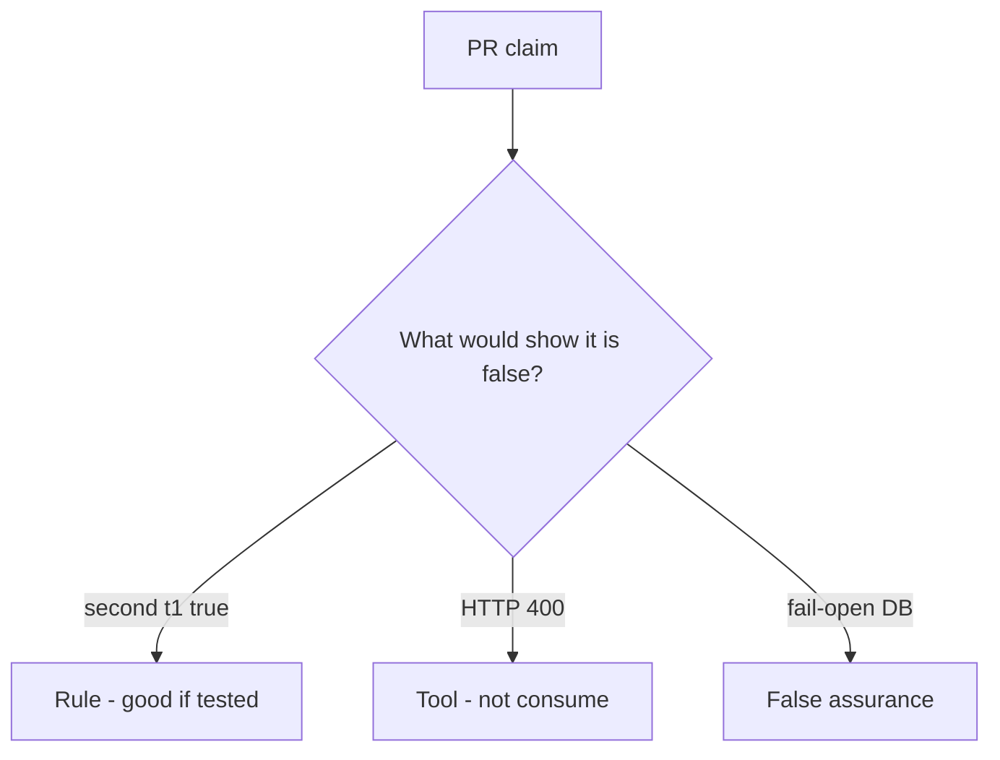

# Review of always-true accept

**Kind:** code-review
**Loop step:** Review

## What you are reviewing

You are reviewing invite. Label each claim **rule**, **tool**, or **false assurance**. Say whether second `accept("t1")` is still true if they ship. Start at consume-once. A mailer ticket can wait.

“Will consume later” does not close `test_invite_token_is_single_use`.

## Picture: problems to find (name them yourself)

**`accept` always true**.

A second accept still has to be false. If the change never records a used-write, that replay path is still open. HTTP 400 after membership already exists is still the same problem.

A unique index that is never written still leaves `accept` always true. Password-reset consume is the same family — name it as leftover, do not skip `test_invite_token_is_single_use`.

## Problems to find (name them yourself)

- `accept` always true
- No unique constraint / no used write
- Fail-open on database error
- Token in query logs (4.3)

Also reject: live race harnesses; closing findings without re-running `test_invite_token_is_single_use`; keys in learner notes; real people's data in the practice files; live invite links in the review notes.

## Common mix-ups

- 400 errors are fail-safe
- Email links prove who received them
- Races are only performance
- A famous-bugs list is the rule
- A unique-index screenshot is consume

## Use it somewhere new

Clinic change that “added a unique index” without a second-accept test is an incomplete review of consume. Name the independent falsehood that would still keep the second `t1` from succeeding.

## Can people still use it

If the dashboard shows “link already used,” do not encode it as color only. That is a cue for people, not the consume.

## What this page is not doing

“Will consume later” is unfinished work, not a merge. Do not click a live invite to prove the finding.
