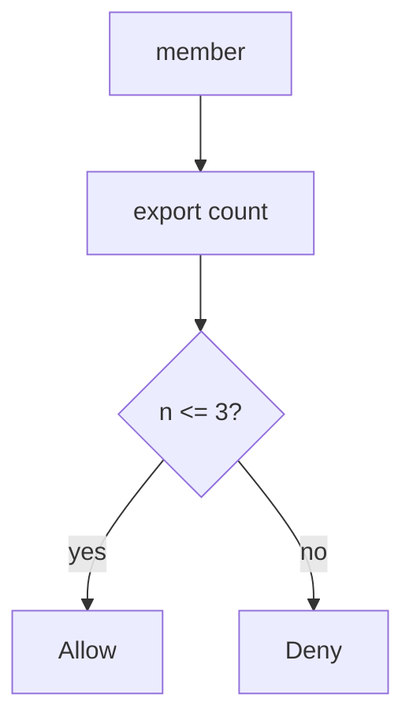
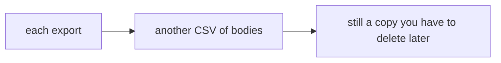

# Export has a budget, not an unbounded loop

**Kind:** concept-model
**Loop step:** 1 Property

## The rule

The notes app lets a member export notes. Export copies note bodies into a CSV. If export can run forever, two things happen: you spend the machine and the bill, and you mint extra copies of the same bodies. Fairness is an **availability and cost** rule, not “ops will scale it.” Module 3.4 already put a cap on shares on the write path. This week’s check is **how many exports in a window**.

> `allow(4)` must be false in the lab window. `allow(3)` may be true. The fourth export is denied.

What must not happen is **unbounded exports (fourth allowed)**. That burns availability and cost. It also makes extra CSVs of note bodies, which is a second secrecy problem from the copies lesson (5.1).

Industry lists want a stop against scripts that burn quota and costly work. They want per-person and whole-app limits written down, then actually enforced. Human timing tricks are **advanced** work, not this week’s pytest. An edge proxy’s request limit is not this sentence.

## Picture: a resource account per person



Who can act: a scripted member, or anyone who stole a session. What you trust in this practice: local `allow(n)`. An IP limit at the edge with no identity is **shared fate**: people behind one office network share a bucket, and a stolen session is not a new IP.

**The tool (not the rule):** a CAPTCHA, autoscaling, or a frontend that disables the export button.

## Picture: extra copies are still copies



A quota is not encryption and not deletion. It bounds how many copies you mint.

## Why it happens, what it costs, how you stop it, how you notice, how you recover

| Slice | For this rule |
|---|---|
| Why it happens | No resource account |
| What has to be true first | `allow(4)` is true |
| Trigger | Fourth export in the window |
| What it costs | Availability, cost, extra copies |
| How you stop it | Per-person quota on the write path |
| How you notice | `quota_denied`; `cost_alert` |
| How you recover | Disable the token; investigate cost |

## What the framework does vs what you still have to check

A web page with `disabled={count>=3}` is not the server. FastAPI has no default export budget. Autoscaling spends more money; it does not enforce the cap. The app’s promise: `allow(4)` is false in the lab window. The folder is `labs/6.7/6.7-lab`. Fake counts only. No live traffic.

## What the tool cannot do

- Per-IP limits punish people on a shared network; you need a per-person account.
- New accounts and GraphQL aliases (7.1) can skip a single counter.
- A legitimate burst needs an **owned** exception, written down, not a silent hole.

## Can people still use it

Quota errors must be something a screen reader can announce. Do not trap keyboard users in a spinner that retries and burns the budget for them.

## Practice

Name CPU, bytes, and paid API calls as budget rows. Then run:

```text
python3 -m pytest labs/6.7/6.7-lab/tests --impl vulnerable
python3 -m pytest labs/6.7/6.7-lab/tests --impl fixed
```

The first command must fail. The second must pass.

## Use it somewhere new

Clinic bulk-export of patients. Notification fan-out. Search complexity later in 7.1.

## What this page is not doing

Live load tests against public hosts, dumping lab Python into notes. Course gates stay unclaimed. Answer keys are not in this file.
