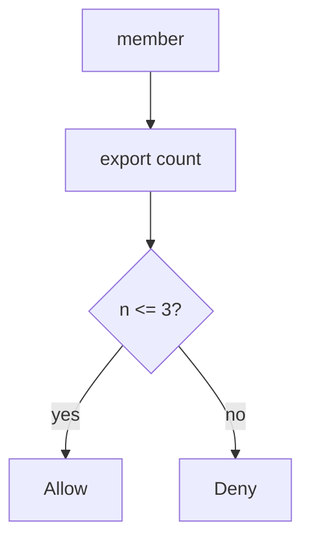
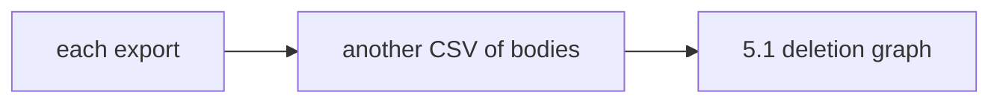

# 6.7-LO-01 — Export has a resource account, not an unbounded loop

**Kind:** concept-model
**Loop step:** 1 Property
**Standards:** OWASP ASVS 5.0.0 (final) `v5.0.0-2.4.1`, `v5.0.0-2.1.3`, `v5.0.0-2.3.2`; `v5.0.0-2.4.2` is **Level 3, advanced**. API4/API6 are *awareness after* the cause (also 3.4). nginx is not this sentence.

## The claim this module owns

SecureCollab Phase 1 export copies note bodies (5.1). Unbounded exports exhaust budget and create extra copies. Fairness is a 1.1 **availability and cost** cell, not “ops will scale it.” Module 3.4 already capped shares on the write path; this module’s cell is **how many exports in a window**.

> `allow(4)` must be false in the lab window. `allow(3)` may be true. The fourth export is denied.

The forbidden outcome is **unbounded exports (4th allowed)**. That is availability/cost plus secondary confidentiality via extra CSVs of bodies.

ASVS `v5.0.0-2.4.1` wants anti-automation against quota exhaustion and costly resources. `v5.0.0-2.1.3` wants documented per-user and global limits. `v5.0.0-2.3.2` wants those limits implemented. `v5.0.0-2.4.2` (human timing) is **Level 3, advanced**.

## Mental model: a resource account per subject



The attacker is a scripted member or a stolen session. Trust is local `allow(n)`. nginx rate limit without identity is **shared-fate**: NAT users share a bucket; a stolen session is not a new IP.

**Mechanism (not the property):** CAPTCHA, autoscaling, or a frontend disable of the button.

## Mental model: extra copies are still 5.1



Quota is not encryption and not deletion. It bounds how many copies you mint.

## Root cause vs impact vs prevention vs detection vs recovery

| Slice | For this property |
|---|---|
| Root cause | No resource account |
| Preconditions | `allow(4)` is true |
| Trigger | Fourth export in the window |
| Impact | Availability, cost, extra copies |
| Prevention | Per-subject quota on the write path |
| Detection | `quota_denied`; `cost_alert` |
| Recovery | Disable token; investigate cost |

## Framework defaults versus the quota guarantee

SPA `disabled={count>=3}` is not the server. FastAPI has no default export budget. Autoscaling spends more money; it does not enforce the cell.

## Mechanism limits

- Per-IP limits punish NAT; need per-subject.
- New accounts and GraphQL aliases (7.1) bypass a single counter.
- Legitimate burst needs an **owned** exception, documented (`v5.0.0-2.1.3`).

## Usability and accessibility

Quota errors must be readable (WCAG 2.2 4.1.3). Do not trap keyboard users in a spinner that retries and amplifies load.

## Practice

Name CPU, bytes, and paid API calls as budget rows. Then run:

```
python3 -m pytest labs/6.7/6.7-lab/tests --impl vulnerable
python3 -m pytest labs/6.7/6.7-lab/tests --impl fixed
```

The first command must fail. The second must pass.

## Transfer

Clinic bulk-export patients. Notification fan-out; search complexity.

## Non-goals

Live load tests against public hosts, dumping lab Python into notes. Gates 0–10 and milestones M0–M5 stay **not-attempted**. Answer keys are not in this file.
