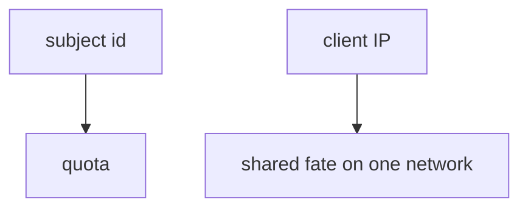
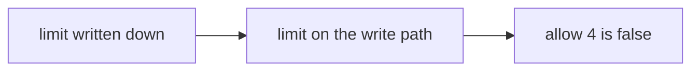

# A quota map someone else can test

**Kind:** design-exercise
**Loop step:** 2 Model

## Could someone else name the checks?

“We rate-limit at the edge” is not this lesson. A map someone else can test names **the person**, **the window**, and **the cap**.

This week’s freeze: local `allow(n_calls)` with cap 3. No live traffic.

> A resource account is a count you can test. The fourth export in the lab window is denied. The first three may be allowed.

## Picture: the person, not the IP

Module 3.4 used a write-path cap for shares. Here the object is **exports in a window**. An IP bucket without a person is shared fate: people on one office network share the limit, and a stolen session is not a new IP.

## Picture: written down is not the same as enforced

A wiki number is not the check. Someone else has to be able to name the pytest cases from your map.

## Step 1: name the pieces

| Piece | This system |
|---|---|
| Who | scripted member; stolen session |
| What | export budget |
| Actions | `allow` |
| Paths | export API |
| What you trust | server-side `n <= 3` |
| What you do not trust | client retry; the export button in the browser |
| Time | lab window |
| The rule | availability + cost + extra copies |

## Step 2: write allow and deny

| Who | What | Action | Decision |
|---|---|---|---|
| member | export 1–3 | run | allow |
| member | export 4 | run | deny |
| web page | disable button | UI | not what you trust |
| edge IP limit | people on one network | throttle | leftover: shared fate |

A missing “fourth export × deny” row is how an unbounded loop appears. Write the hole.

## Practice

Draw the budget so someone else could name the pytest cases. Point at `labs/6.7/6.7-lab` file `limit.py`. Fake counts only.

## Use it somewhere new

Notification fan-out. GraphQL aliases later in 7.1.

## What can still go wrong

New accounts that reset the window. An owned burst exception with no owner. Human timing tricks (advanced, not this pytest).

## What this page is not doing

Do not define security as a famous-bugs list. Do not run this map against a live clinic or a public host. Answer keys stay out of lessons.
