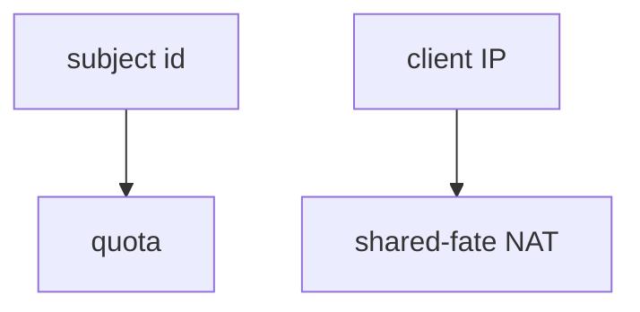
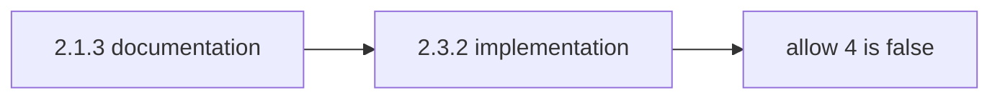

# 6.7-LO-02 — A quota map a second engineer can test

**Kind:** design-exercise
**Loop step:** 2 Model
**Standards:** OWASP ASVS 5.0.0 (final) `v5.0.0-2.4.1`, `v5.0.0-2.1.3`.

## Can a second engineer name pytest cases from your budget map?

“We rate-limit at the edge” is not this lesson. A reviewable model names **the subject, the window, and the cap**.

SecureCollab Phase 1 freeze: local `allow(n_calls)` with cap 3. No live traffic.

## Mental model: subject, not IP

Module 3.4 used a write-path cap for shares. Here the object is **exports in a window**.

## Mental model: documented limit vs implemented limit

A wiki number is not the predicate.

## Step 1: freeze pieces

| Piece | This system |
|---|---|
| Subjects | scripted member; stolen session |
| Objects | export budget |
| Actions | `allow` |
| Channels | export API |
| TCB | server-side `n <= 3` |
| Untrusted | client retry; SPA button |
| State / time | lab window |
| 1.1 cell | availability + cost + extra copies |

## Step 2: write cells

| Subject | Object | Action | Decision |
|---|---|---|---|
| member | export 1–3 | run | allow |
| member | export 4 | run | deny |
| SPA | disable button | UI | not TCB |
| edge IP limit | NAT users | throttle | shared-fate residual |

## Practice

Draw the budget. Point at `labs/6.7/6.7-lab` file `limit.py`.

## Transfer

Notify fan-out; GraphQL aliases (7.1).

## Residual risk

New accounts; owned burst exception; Level 3 human timing (`v5.0.0-2.4.2`).

## Non-goals

Top 10 as the definition of security. Keys stay out of lessons.
