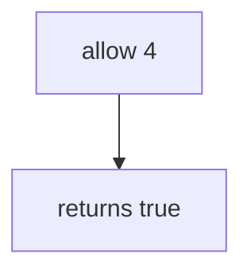

# 6.7-LO-03 — Observe the fourth allow, do not trophy a public host

**Kind:** mechanism-lab
**Loop step:** 3 Break
**Standards:** OWASP ASVS 5.0.0 (final) `v5.0.0-2.4.1`.

## Authorized scope

`labs/6.7/6.7-lab` only. Synthetic call counts. No live load tests.

**Forbidden outcome:** Unbounded exports (4th allowed in the lab window).

## Mental model: allow always true



The vulnerable tree demonstrates **cause** (no resource account). Do not aim a load generator at anything except this fixture.

## What to read in the fixture

`vulnerable/limit.py` returns true for every `n`. Tests require `allow(4)` false and `allow(3)` true.

## Root cause vs impact

| Slice | Lab |
|---|---|
| Root cause | No resource account |
| Impact | Cost/DoS; extra CSV copies |
| Not the lesson | API4 as the definition |

## Practice

```
python3 -m pytest labs/6.7/6.7-lab/tests --impl vulnerable
```

Record `test_fourth_export_is_denied`. Do not probe public hosts.

## Transfer

Clinic bulk-export. Predict without leaving this directory.

## Non-goals

No live-target instructions. Synthetic data only.
