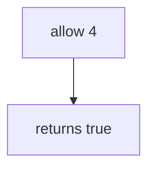

# Practice: unbounded exports (fourth allowed)

**Kind:** mechanism-lab
**Loop step:** 3 Break

## Try it

The practice is not a website you attack. It is a tiny Python `allow`. It does not open a live export API. The failure is already in the function: it says yes for every `n`. That is a **failed rule**, not a trophy against a public host.

The rule under test:

> Export has a resource account, not an unbounded loop. `allow(4)` must be false in the lab window. `allow(3)` may be true.

## Where you may practice

Only `labs/6.7/6.7-lab` is in scope. The practice is an in-process `allow`. Fake call counts. It does not talk to the network.

Do not load-test a public host. Do not probe an employer export API. Do not probe a classmate preview. Do not paste a live export “to see what happens.”

What must not happen: unbounded exports (fourth allowed in the lab window). `allow(4)` returns true.

Who could do this: a scripted session that calls export more than three times. That stands in for a clinic “Export all” button, notification fan-out, or GraphQL aliases later in 7.1. What is supposed to stop this: `allow` is a **per-person resource account** on the export action. A disabled button in the browser, an IP bucket, a CAPTCHA, and autoscaling are not enough.

## Picture: allow always true



The broken files show **cause** (no resource account). Do not aim a load generator at anything except this practice. What has to be true first: `allow` returns true for every `n`. You do not need HTTP. You must not load-test a public host.

Industry lists ask for a stop against scripts that burn quota. Module 3.4 already capped shares on the write path. This check is how many **exports** in a window. A famous API-abuse list is a later name, not this check.

## What to look at: the cause, not a trophy

Read `vulnerable/limit.py`. It returns true for every `n`. Tests:

- `test_fourth_export_is_denied`
- `test_third_export_is_allowed`
- `test_first_export_is_allowed` — honest path; may pass on both

You do not need a new `n`. The failure of `test_fourth_export_is_denied` *is* the evidence.

Do not open the repaired files yet. Diagnose the cause first.

| What you see | What kind of failure | Not the lesson |
|---|---|---|
| `allow(4)` is true | No resource account | A famous API-abuse list |
| `allow` true for every `n` | Unbounded loop | “The edge will throttle it” |
| Fourth export in the window succeeds | What must not happen | A public load test |

## Why it happens, what it costs, how you stop it, how you notice, how you recover

| Slice | This practice |
|---|---|
| The rule | Fourth export in the window is denied |
| Why it happens | No resource account |
| What has to be true first | `allow(n)` is always true |
| Trigger | `allow(4)` |
| What it costs | Availability and cost, plus extra CSV copies of bodies (5.1) |
| How you stop it | Server check `n <= 3` on the export action |
| How you notice | `quota_denied`; `cost_alert`; never the CSV body |
| How you recover | Keep deny; revoke the session if it looks automated |
| Not the lesson | A famous API-abuse list, an edge IP limit, a CAPTCHA, or a public load test |

## What the framework does vs what you still have to check

An IP limit at the edge is a bucket per address, not a per-person export account. FastAPI will run export as often as you call it. Next.js disabling a button does not bind `n`. What this practice is supposed to show: `allow(4)` is false.

## Practice

From the repository root, in a throwaway environment:

```text
python3 -m pytest labs/6.7/6.7-lab/tests --impl vulnerable
```

Record `test_fourth_export_is_denied`. Do not probe public hosts. A setup error is not proof the rule holds.

## Use it somewhere new

Clinic bulk-export. Predict without leaving this directory. Do not load-test a live clinic system.

## What this page is not doing

No live-target instructions. Fake counts only. No public load tests. Do not “fix” the practice by deleting the test.
