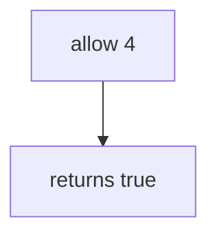

# 6.7-LO-03 — Observe the fourth allow, do not trophy a public host

**Kind:** mechanism-lab
**Loop step:** 3 Break
**Standards:** OWASP ASVS 5.0.0 (final) `v5.0.0-2.4.1`. `v5.0.0-2.4.2` (human timing) is **Level 3, advanced**. API4/API6 are awareness after the cause (also 3.4).

## Authorized scope

`labs/6.7/6.7-lab` only. The fixture is an in-process `allow`. Synthetic call counts. No live load tests, no public hosts, no employer export API.

**Forbidden outcome:** unbounded exports (4th allowed in the lab window). `allow(4)` returns true.

Attacker capability in this lab: a scripted session that calls export more than three times. That stands in for a clinic “Export all” button, notification fan-out, or GraphQL aliases later in 7.1. Trust assumption: `allow` is supposed to be a **per-subject resource account** on the export action. A disabled SPA button, an IP bucket, CAPTCHA, and autoscaling are not in the TCB for this cell.

## Mental model: allow always true



The vulnerable tree demonstrates **cause** (no resource account). Do not aim a load generator at anything except this fixture. Preconditions: `allow` returns true for every `n`. You do not need HTTP. You must not load-test a public host.

ASVS `v5.0.0-2.4.1` wants anti-automation against quota exhaustion. Module 3.4 already capped shares on the write path; this cell is how many **exports** in a window.

## What to read in the fixture

`vulnerable/limit.py` returns true for every `n`. Tests:

- `test_fourth_export_is_denied`
- `test_third_export_is_allowed`
- `test_first_export_is_allowed` — honest path; may pass on both

You do not need a new `n`. The failure of `test_fourth_export_is_denied` *is* the evidence.

Do not open the fixed tree yet. Diagnose the cause first.

## Root cause vs impact vs prevention vs detection vs recovery

| Slice | This lab |
|---|---|
| Required property | Fourth export in the window is denied |
| Root cause | No resource account |
| Preconditions | `allow(n)` is always true |
| Trigger | `allow(4)` |
| Impact | Availability/cost plus extra CSV copies of bodies (5.1) |
| Prevention | Server predicate `n <= 3` on the export action |
| Detection | `quota_denied`; `cost_alert`; never the CSV body |
| Recovery | Keep deny; revoke session if automated |
| Not the lesson | API4, nginx, CAPTCHA, or a public load test |

## Framework defaults versus the quota guarantee

nginx rate-limit is an IP bucket, not a per-subject export account. FastAPI will run export as often as you call it. Next.js disabling a button does not bind `n`. The application guarantee is: **this** fixture, `allow(4)` is False.

## Practice

```text
python3 -m pytest labs/6.7/6.7-lab/tests --impl vulnerable
```

Record `test_fourth_export_is_denied`. Do not probe public hosts. An environment error is not security evidence.

## Transfer

Clinic bulk-export. Predict without leaving this directory. Do not load-test a live EHR.

## Non-goals

No live-target instructions. Synthetic counts only. No public load tests.
