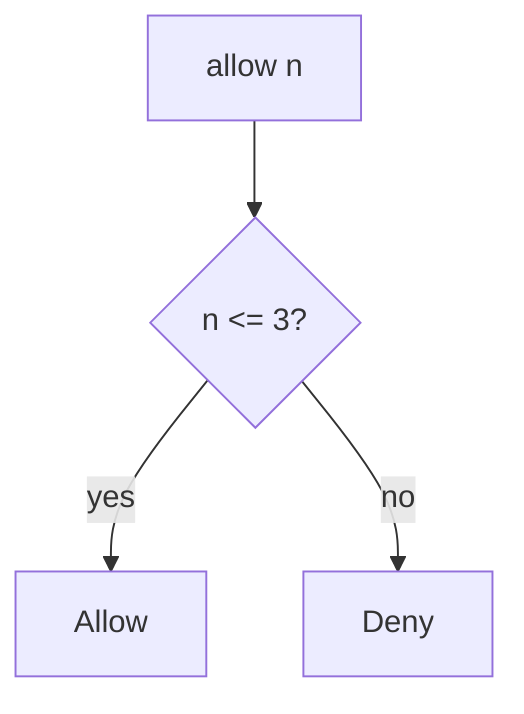

# 6.7-LO-04 — Enforce the cap on the write path

**Kind:** design-exercise
**Loop step:** 4 Build
**Standards:** OWASP ASVS 5.0.0 (final) `v5.0.0-2.4.1`, `v5.0.0-2.3.2`.

## Structural means the server counts

`allow(n)` must be `n <= 3`. Structural means that predicate on the export action — not a disabled button, not an IP bucket, not autoscaling.

## Mental model: deny at four



Fail-safe: unknown count **denies**.

## Why this restores the cell

| After the fix | Must be true |
|---|---|
| `allow(3)` | true |
| `allow(4)` | false |
| `allow(1)` | true |

## What this is not

Frontend-only cap (3.4 already refused that for shares). Global IP limit. CAPTCHA as the quota. Autoscaling as the control.

## Practice

Name the predicate. Run:

```
python3 -m pytest labs/6.7/6.7-lab/tests --impl fixed
```

Must pass.

## Transfer

Clinic: stop treating “Export” as unlimited.

## Residual risk

New accounts; GraphQL aliases (7.1); `v5.0.0-2.4.2` Level 3 human timing; owned burst exception.
