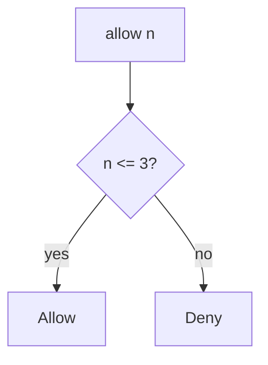

# Enforce the cap on the write path

**Kind:** design-exercise
**Loop step:** 4 Build

## The rule

A disabled export button is not the fix. An IP bucket at the edge is not the fix. Autoscaling is not the fix. A CAPTCHA is not the quota.

Structural means the server counts. `allow(n)` must be `n <= 3`. That check lives on the export action — the write path — not in the browser.

The smallest restore for notes-app export is: deny at four. Fail closed: if the count is unknown, **deny**. Do not fail open because the counter store was unreachable.

## Picture: deny at four



The lab’s repaired files use `n_calls <= 3`. Production still needs a per-person counter (the map from the last page), not a global IP limit that punishes people on one office network. GraphQL aliases (7.1) are another path of the same budget. New accounts can reset the window — name that leftover. Human timing tricks are advanced work, not this check.

Documented limits have to be actually implemented. This week's check covers `allow(4)`.

## What the repaired files must show

Read `fixed/limit.py` against this checklist. Do not treat the snippet as a production rate limiter.

| After the fix | Must be true |
|---|---|
| `allow(3)` | true |
| `allow(4)` | false |
| `allow(1)` | true |

Fail closed: if you cannot read the count, the answer is deny. Uncertainty is a **no**, not a yes because the store was down.

## What this is not

Frontend-only cap (3.4 already refused that for shares). Global IP limit. CAPTCHA as the quota. Autoscaling as the control. A CDN filter as the resource account. HTTP 429 without a server count.

## What the tool cannot do

- New accounts reset the window unless identity is expensive.
- GraphQL aliases and extra export formats skip a counter that only wraps one route.
- How much disk a file can take is a different budget (later, 6.4).
- Owned burst exceptions must be written down, not silent.
- Extra CSV copies are still a secrecy leftover from 5.1 even when the fourth is denied later.

## Practice

Name the check (`n <= 3`). Run:

```text
python3 -m pytest labs/6.7/6.7-lab/tests --impl fixed
```

It must pass. Then write one sentence: which rule is restored, and which leftover you refused to delete.

## Use it somewhere new

A clinic example: stop treating “Export” as unlimited; count on the server.

## What can still go wrong

New accounts; GraphQL aliases (7.1); human timing (advanced); owned burst exception; extra copies (5.1).

## What this page is not doing

Do not load-test a public host. Do not claim a course gate from an edge-proxy screenshot.
