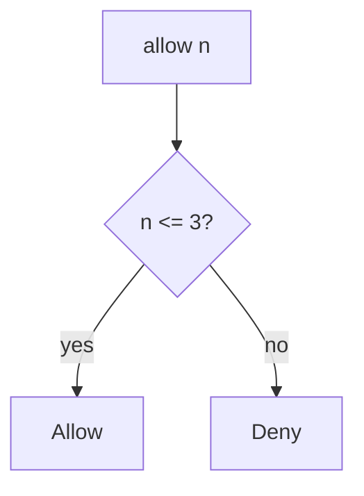

# 6.7-LO-04 — Enforce the cap on the write path

**Kind:** design-exercise
**Loop step:** 4 Build
**Standards:** OWASP ASVS 5.0.0 (final) `v5.0.0-2.4.1`, `v5.0.0-2.3.2`. `v5.0.0-2.1.3` wants documented limits. `v5.0.0-2.4.2` is **Level 3, advanced**.

## Structural means the server counts

`allow(n)` must be `n <= 3`. Structural means that predicate on the export action — not a disabled button, not an IP bucket, not autoscaling, not CAPTCHA as the quota.

The smallest restore for SecureCollab Phase 1 export is: deny at four. Fail-safe: unknown count **denies**. Do not fail open because the counter store was unreachable.

## Mental model: deny at four



The lab’s fixed tree is `n_calls <= 3`. Production still needs a per-subject counter (LO-02), not a global IP limit that punishes a NAT. GraphQL aliases (7.1) are another path of the same budget. New accounts can reset the window — named residual. Human timing (`v5.0.0-2.4.2` Level 3 advanced) is not this pytest.

ASVS `v5.0.0-2.3.2` wants documented limits implemented. This pytest is that sentence for `allow(4)`.

## Why this restores the cell

| After the fix | Must be true |
|---|---|
| `allow(3)` | true |
| `allow(4)` | false |
| `allow(1)` | true |

## What this is not

Frontend-only cap (3.4 already refused that for shares). Global IP limit. CAPTCHA as the quota. Autoscaling as the control. CDN WAF as the resource account. HTTP 429 without a server count.

## Mechanism limits

- New accounts reset the window unless identity is expensive.
- GraphQL aliases and extra export formats skip a counter that only wraps one route.
- File storage quotas (`v5.0.0-5.2.4` Level 3, 6.4) are a different resource.
- Owned burst exceptions must be documented, not silent.
- Extra CSV copies are a 5.1 confidentiality residual even when the fourth is denied later.

## Practice

Name the predicate (`n <= 3`). Run:

```text
python3 -m pytest labs/6.7/6.7-lab/tests --impl fixed
```

Must pass.

## Transfer

Clinic: stop treating “Export” as unlimited; count on the server.

## Residual risk

New accounts; GraphQL aliases (7.1); Level 3 human timing; owned burst exception; extra copies (5.1).

## Non-goals

Do not load-test a public host. Do not claim Gate 6 from an nginx screenshot.
