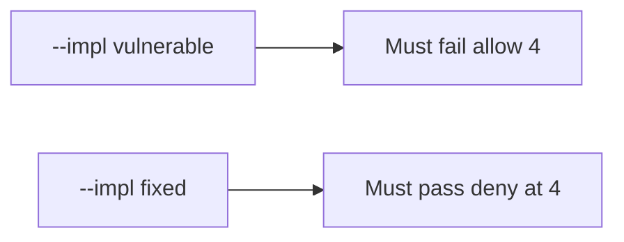

# 6.7-LO-05 — Evidence is fourth denied, then a passing pair

**Kind:** verification-lab
**Loop step:** 5 Verify
**Standards:** OWASP ASVS 5.0.0 (final) `v5.0.0-2.4.1`.

## An invariant that cannot fail a test is still a slogan

“Rate limit is on” is not evidence. The oracle is the local pair. Do not load-test public hosts.

## Mental model: fail-on-vulnerable, pass-on-fixed



| Case | Must show |
|---|---|
| Negative / abuse | `allow(4)` false |
| Normal | `allow(3)` and `allow(1)` true |
| Not claimed | per-IP fairness; GraphQL; live RPS |

```
python3 -m pytest labs/6.7/6.7-lab/tests --impl vulnerable
python3 -m pytest labs/6.7/6.7-lab/tests --impl fixed
```

Honest `allow(3)` may pass on both.

## What the tests do not prove

- Human timing Level 3 (`v5.0.0-2.4.2`)
- Per-subject vs per-IP in production (named in LO-02)
- File storage quotas (`v5.0.0-5.2.4` Level 3, 6.4)
- Cost of a real cloud bill

## Practice

Execute both implementations. Map each test to an LO-02 cell.

## Transfer

Clinic bulk-export. A test that only asserts HTTP 200 on `/export` is not this cell.
