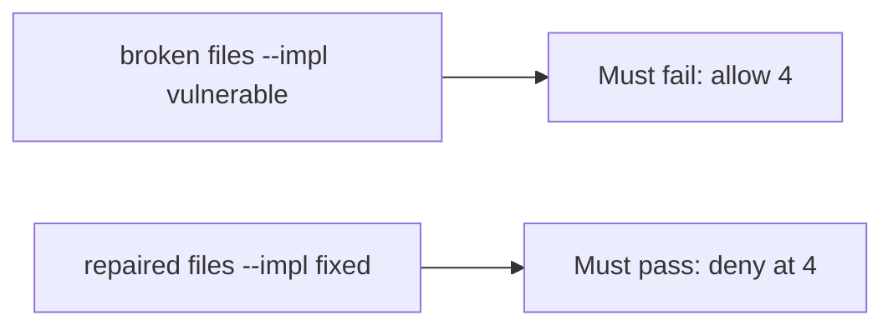

# An unbounded allow must fail the check

**Kind:** verification-lab
**Loop step:** 5 Verify

## Check it

“Rate limit is on” is not evidence. “The button is disabled” is a tool observation. The check is: `allow(4)` is false and `allow(3)` is true. That fourth-export observation must be **false** on the broken files (returns true) and **true** on the repaired files. Do not load-test public hosts.

## Picture: unbounded allow must fail the check

A passing-test tally can still hide that the fourth export still goes through.



If both pass, you are not looking at the fourth export.

## What the check has to show

| Mode | Must show for this topic |
|---|---|
| Normal | `allow(3)` and `allow(1)` true (may pass on both) |
| Wrong input / abuse | `allow(4)` false; broken files must fail |
| Failure | If you cannot read the count, deny |
| Not claimed | Per-IP fairness; GraphQL; live requests per second |

The test `test_fourth_export_is_denied` is there so an unbounded fourth still fails.

Searching for an edge-proxy keyword without calling `allow(4)` is not evidence. This practice never opens a public host.

```text
python3 -m pytest labs/6.7/6.7-lab/tests --impl vulnerable
python3 -m pytest labs/6.7/6.7-lab/tests --impl fixed
```

Honest `allow(3)` may pass on both implementations. That does not excuse the fourth-deny test. If the broken files do not fail `allow(4)`, the lab is miswired — fix the wiring, not the assertion. A setup error is not proof the rule holds.

## What the tests do not prove

- Human timing tricks (advanced, not this check)
- Per-person vs per-IP in production (named in the quota map)
- File storage quotas (a different budget, later)
- Cost of a real cloud bill
- GraphQL alias multiplication (7.1)

## Practice

```text
python3 -m pytest labs/6.7/6.7-lab/tests --impl vulnerable
python3 -m pytest labs/6.7/6.7-lab/tests --impl fixed
```

Do not treat a grep for an edge-proxy keyword as the check. Call `allow(4)`.

## Use it somewhere new

Clinic bulk-export. Asserting HTTP 200 on `/export` is not this check (see 9.3). Do not use a public load test.

## What this page is not doing

Do not treat a live load screenshot as proof. Do not log CSV bodies. Answer keys are not on this site.
