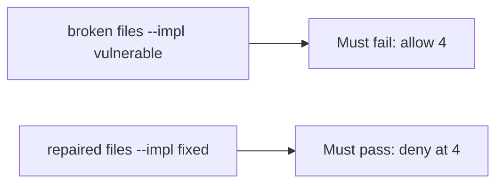

# An unbounded allow must fail the check

**Kind:** verification-lab
**Loop step:** 5 Verify

## Check it

A rate-limit product name does not cap the fourth export. A disabled button is the UI. `allow(4)` has to be false and `allow(3)` has to be true. On the broken files the fourth export still returns true. On the repaired files it does not. Do not load-test public hosts.

## Picture: unbounded allow must fail the check

The fourth export can still go through a green suite.



If the broken exporter still passes, the fourth export was never capped.

## What the check has to show

| Mode | Must show for this topic |
|---|---|
| Normal | `allow(3)` and `allow(1)` true (may pass on both) |
| Wrong input / abuse | `allow(4)` false; broken files must fail |
| Failure | If you cannot read the count, deny |
| Not claimed | Per-IP fairness; GraphQL; live requests per second |

The test `test_fourth_export_is_denied` is there so an unbounded fourth still fails.

An edge-proxy keyword is not `allow(4)`. This practice never opens a public host.

```text
python3 -m pytest labs/6.7/6.7-lab/tests --impl vulnerable
python3 -m pytest labs/6.7/6.7-lab/tests --impl fixed
```

`allow(3)` may pass on both sides. You still have to deny the fourth export. If the broken files do not fail `allow(4)`, the lab is miswired — fix the wiring, not the assertion. A setup error is not proof the rule holds.

## What the tests do not prove

- Human timing tricks (advanced, not this check)
- Per-person vs per-IP in production (named in the quota map)
- File storage quotas (a different budget, later)
- Cost of a real cloud bill
- GraphQL alias multiplication (7.1)

## Practice

Call `allow(4)`. An edge-proxy keyword is someone else’s counter.

## Use it somewhere new

A 200 from `/export` does not prove the fourth export was capped (see 9.3). Do not use a public load test.

## What this page is not doing

A live load screenshot is not the fourth export denied. Do not log CSV bodies. Answer keys are not on this site.
