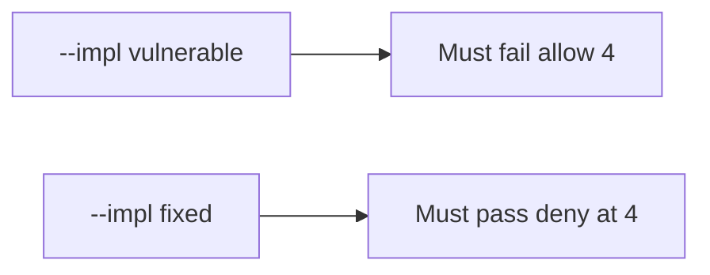

# 6.7-LO-05 — Evidence is fourth denied, then a passing pair

**Kind:** verification-lab
**Loop step:** 5 Verify
**Standards:** OWASP ASVS 5.0.0 (final) `v5.0.0-2.4.1`.

## An invariant that cannot fail a test is still a slogan

“Rate limit is on” is not evidence. “The button is disabled” is a mechanism observation. The oracle is: `allow(4)` is false and `allow(3)` is true. The fourth observation must be **false** on `--impl vulnerable` (returns true) and **true** on `--impl fixed`. Do not load-test public hosts.

## Mental model: vulnerable must fail: allow 4

The failing observation on `--impl vulnerable` is **allow 4**. A passing collection count is not this cell.



| Mode | Must show for this module |
|---|---|
| Negative / abuse | `allow(4)` false; vulnerable must fail |
| Normal | `allow(3)` and `allow(1)` true (may pass on both) |
| Not claimed | per-IP fairness; GraphQL; live RPS |

Lab tests in `labs/6.7/6.7-lab/tests/test_property.py`. `test_fourth_export_is_denied` is a **forbidden-outcome** test: an unbounded fourth is not allowed to count as a passing control.

```text
python3 -m pytest labs/6.7/6.7-lab/tests --impl vulnerable
python3 -m pytest labs/6.7/6.7-lab/tests --impl fixed
```

Honest `allow(3)` may pass on both implementations. That does not excuse the fourth-deny test. If vulnerable does not fail `allow(4)`, the lab is miswired—fix the wiring, not the assertion.

## What the tests do not prove

- Human timing Level 3 (`v5.0.0-2.4.2`)
- Per-subject vs per-IP in production (named in LO-02)
- File storage quotas (`v5.0.0-5.2.4` Level 3, 6.4)
- Cost of a real cloud bill
- GraphQL alias multiplication (7.1)

Record those as residuals or later modules, not as silent passes.

## Practice

Execute both implementations this session. Write the fail/pass pair next to the matrix row. Reject a “test” that only greps `limit_req` in nginx without calling `allow(4)`.

## Transfer

Clinic bulk-export. A test that only asserts HTTP 200 on `/export` is not this cell (see 9.3). A public load test is out of scope.

## Non-goals

Do not add a live RPS trophy. Do not log CSV bodies. Keys stay out of this file.
