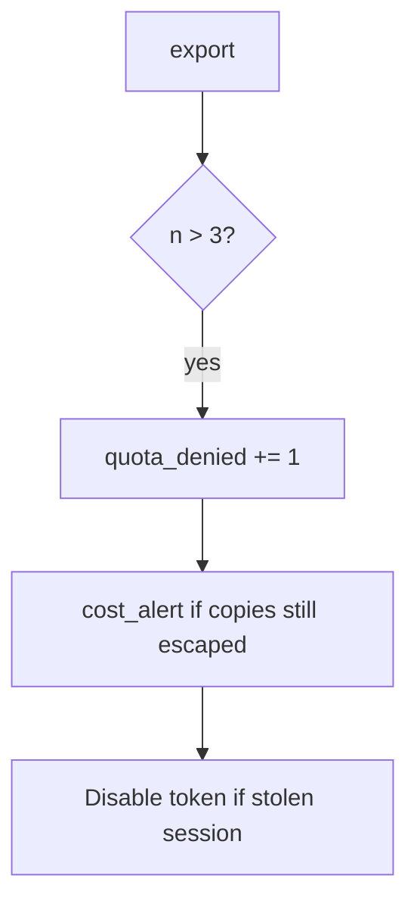

# 6.7-LO-06 — Detect quota_denied and cost_alert

**Kind:** operations-exercise
**Loop step:** 6 Operate
**Standards:** NIST CSF 2.0 (final) DE/RS/RC as outcome labels; OWASP ASVS 5.0.0 (final) `v5.0.0-2.4.1`.

## Prevention is not absolute

A new export format can skip the counter. Pair detect and recover. Do not log note bodies in the CSV path (3.1 / 5.1).

## Mental model: fourth try is a signal



| Outcome | This module |
|---|---|
| Detect | `quota_denied`; `cost_alert` |
| Signal | request id, subject id, n; never the CSV body |
| Recover | Keep deny; revoke session if automated; owned burst exception if documented |
| Residual | New accounts; GraphQL (7.1) |

## Practice

Write one log line you would accept. Tie it to `labs/6.7/6.7-lab`.

```
log_denied reason=quota_denied n=4 subject=user_67e request_id=req_67e
```

Reject any line that includes note bodies, a real email, or a live RPS trace against a public host.

## Transfer

Clinic: detect bulk-export over quota; do not attach the CSV to the ticket.

## Non-goals

A CDN WAF product name is not the property.
