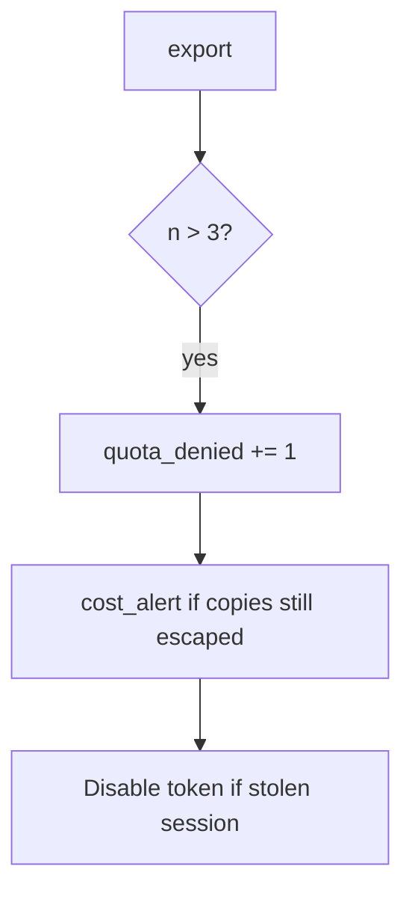

# 6.7-LO-06 — Detect quota_denied and cost_alert

**Kind:** operations-exercise
**Loop step:** 6 Operate
**Standards:** NIST CSF 2.0 (final) DE/RS/RC as outcome labels; OWASP ASVS 5.0.0 (final) `v5.0.0-2.4.1`. CSF names outcomes; it does not count exports.

## Prevention is not absolute

A new export format can skip the counter after `allow` was “fixed once.” Pair detect and recover. Do not log note bodies in the CSV path (3.1 / 5.1). Do not attach the CSV to the ticket.

## Mental model: fourth try is a signal



| Outcome | This module |
|---|---|
| Detect | `quota_denied`; `cost_alert` |
| Signal | request id, subject id, n; never the CSV body |
| Recover | Keep deny; revoke session if automated; owned burst exception if documented |
| Residual | New accounts; GraphQL (7.1) |

CSF 2.0 Detect / Respond / Recover name outcomes. They do not prove `v5.0.0-2.4.1`. A CDN WAF product name is not the property. Re-run `test_fourth_export_is_denied` after any export-route change; a green “rate limit enabled” tile is not that pytest. Notification fan-out and extra formats are other paths of the same budget — inventory them before claiming Recover.

## Framework defaults versus the operate guarantee

An nginx dashboard will show 429s on an IP and stay silent when `/export.csv` still has no per-subject counter. Detection must observe **`allow(4)` false**, not HTTP status counts. If the alert includes note bodies from the CSV, you have opened a 3.1 / 5.1 cell.

## Practice

Write one log line you would accept. Tie it to `labs/6.7/6.7-lab`.

```text
log_denied reason=quota_denied n=4 subject=user_67e request_id=req_67e
```

Reject any line that includes note bodies, a real email, or a live RPS trace against a public host.

## Transfer

Clinic: detect bulk-export over quota; do not attach the CSV to the ticket. Do not load-test a live EHR.

## Usability

If a human sees a quota deny, announce “try tomorrow” (WCAG 2.2 Success Criterion 4.1.3). A spinner that retries spends the budget for them.

## Non-goals

A CDN WAF product name is not the property. Public load tests are out of scope. Gates 0–10 stay not-attempted.
