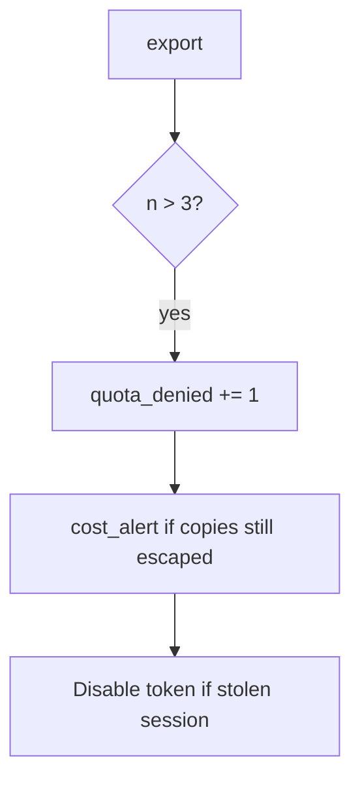

# Notice quota_denied and cost_alert

**Kind:** operations-exercise
**Loop step:** 6 Operate

## Fixing it once is not enough

A new export format can skip the counter after `allow` caps at three. Page the fourth export, contain the extra CSV, and restore the quota.

Skip note bodies and the extra CSV in the ticket.

## Picture: the fourth try is a signal

If a fourth export lands in the window, keep note bodies out of the pager. Then keep the deny and revoke a stolen session.



A rate-limit dashboard tile does not increment `quota_denied` on the fourth CSV.

## Signals that do not become a second leak

| Outcome | This topic |
|---|---|
| Notice | `quota_denied`; `cost_alert` |
| What the line holds | request id, subject id, n — **never** the CSV body |
| Respond | Keep deny |
| Recover | Revoke the session if it looks automated; owned burst exception if it is written down; re-run `test_fourth_export_is_denied` |
| Leftover | New accounts; GraphQL aliases (7.1) |

```text
log_denied reason=quota_denied n=4 subject=user_67e request_id=req_67e
```

A note body, a CSV attachment, a real email, or a live load trace against a public host in the export sample is a live-target record.

Note bodies from the CSV in the fourth-export ticket are extra copies of the export.

Enabling a rate limit does not deny the fourth export. Notification fan-out and extra formats still need the fourth-export deny. The fourth call still has to fail `test_fourth_export_is_denied`.

## What the framework does vs what you still have to check

Edge 429s on an IP do not put a per-person counter on `/export.csv`. Gate on **`allow(4)` false**, not HTTP status counts. CSV note bodies on `quota_denied` reopen topics 3.1 and 5.1.

## Practice

A deny line needs ids, a reason, and n — not the CSV body. Note bodies, a real email, or a live load trace against a public host would make the deny line a live-target record.

## Use it somewhere new

Notice bulk-export over quota; do not attach the CSV to the ticket. Do not load-test a live clinic system.

## Can people still use it

If a human sees a quota deny, announce “try tomorrow.” A spinner that retries spends the budget for them.

## What this page is not doing

Do not follow public load tests. This site does not mark you as finished. Answer keys are not on this site.
