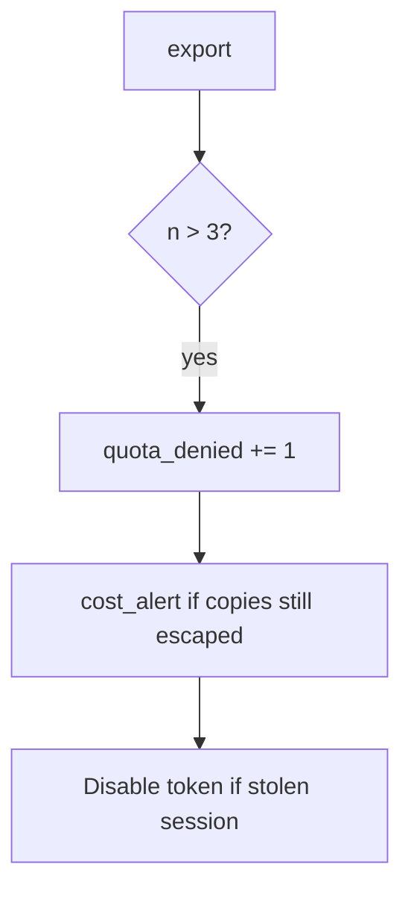

# Notice quota_denied and cost_alert

**Kind:** operations-exercise
**Loop step:** 6 Operate

## Fixing it once is not enough

Even after `allow` was “fixed once,” a new export format can skip the counter. Running it for real is the rest of the loop: notice, contain, and recover.

Do not log note bodies in the CSV path (3.1 / 5.1). Do not attach the CSV to the ticket.

## Picture: the fourth try is a signal

A fourth export in the window is something you still have to notice and recover from, not an excuse to quote note bodies in the paging channel. Recover keeps the deny and revokes a stolen session.



A vendor name does not count exports. Someone still has to own the budget.

## Signals that do not become a second leak

| Outcome | This topic |
|---|---|
| Notice | `quota_denied`; `cost_alert` |
| What the line holds | request id, subject id, n — **never** the CSV body |
| Respond | Keep deny |
| Recover | Revoke the session if it looks automated; owned burst exception if it is written down; re-run `test_fourth_export_is_denied` |
| Leftover | New accounts; GraphQL aliases (7.1) |

```text
log_denied reason=quota_denied n=4 subject=user_67e request_id=req_67e
```

Not: a note body, a CSV attachment, a real email, or a live load trace against a public host.

If your alert includes note bodies from the CSV, you have opened a second leak in the paging channel.

A green “rate limit enabled” tile is not that check. Notification fan-out and extra formats are other paths of the same budget — inventory them before claiming recover. Re-run `test_fourth_export_is_denied` after any export-route change.

## What the framework does vs what you still have to check

An edge dashboard will show 429s on an IP and stay silent when `/export.csv` still has no per-person counter. Detection must observe **`allow(4)` false**, not HTTP status counts. If the alert includes note bodies from the CSV, you have opened a leftover hole from topics 3.1 and 5.1.

## Practice

Write a log line (ids, reason, n, no body). Reject any line that includes note bodies, a real email, or a live load trace against a public host.

## Use it somewhere new

A clinic example: notice bulk-export over quota; do not attach the CSV to the ticket. Do not load-test a live clinic system.

## Can people still use it

If a human sees a quota deny, announce “try tomorrow.” A spinner that retries spends the budget for them.

## What this page is not doing

Do not follow public load tests are out of scope. This site does not mark you as finished. Answer keys are not on this site.
