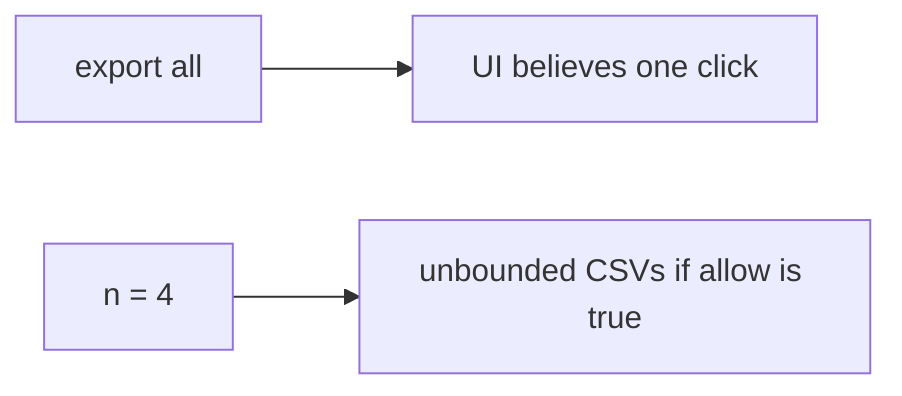

# Same idea on clinic bulk-export

**Kind:** transfer-challenge
**Loop step:** 7 Transfer

## Use it somewhere new

You get a **clinic bulk-export** of patients.

`allow(4)` must be false in the lab window. Export has a resource account, not an unbounded loop. For a clinic, the fourth bulk-export is denied, the first three may be allowed.

Also name notification fan-out and search complexity as the same budget family (7.1), without running those systems.

## Picture: bulk export is still a budget row

A patient bulk-export is the notes-app export budget.

| Notes app | Clinic sketch |
|---|---|
| `allow(n)` on export | Bulk-export of patients |
| Cap 3 in the lab window | Same shape: a per-person resource account |
| Fourth export denied | Fourth bulk-export denied |
| Scripted member | Scripted clinician session — **not** a live clinic |

If “Export all” is a disabled button in the browser while the server `allow` is always true, the check is gone. FastAPI, an IP limit at the edge, and a CAPTCHA do not count `n` per person. Notification fan-out and GraphQL search complexity (7.1) are the same budget family — name them, do not run those systems here. Extra CSVs are still copies from 5.1 even when the UI said “once.”

The fourth export still has to be false. The third may still be true. Rate-limiting at the edge without a per-person fourth-export test leaves `allow(4)` true. The local check is `test_fourth_export_is_denied` — on a practice, not a live clinic load test.

## Write this for a clinic bulk-export

A small clinic app with an “Export all” button that is disabled in the browser.

1. who might try (scripted clinician session — not a live clinic);
2. what you trust (server `n <= 3` is what you trust; the disabled button and an IP rate limit are not);
3. what must not happen (`allow(4)` true);
4. stay on **local** practice files only (fourth denied — never on the real clinic);
5. leftover (new accounts, GraphQL aliases, human timing as advanced work, extra copies from 5.1);
6. whether a human-read “try tomorrow” must be announced, not a spinner that retries and burns the budget.

## What is not good enough

| Reject | Why |
|---|---|
| “CAPTCHA is on” | Not a resource account |
| Live clinic / public load test | Course rules |
| Autoscaling | Spends more; does not enforce the cap |
| HTTP 200 as quota evidence | Wrong observation |
| Disabled button as the cap | The client is not what you trust (3.4) |

## Practice

Deny the fourth export in the window. Keep the answer keys closed. The only running system you may break is `labs/6.7/6.7-lab`. Do not load-test a public host.

## What this page is not doing

Do not try live-target load tests. Do not use real patient CSVs. This page does not finish a check-in.
