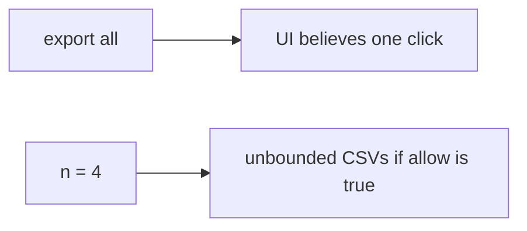

# 6.7-LO-07 — Transfer: clinic bulk-export patients

**Kind:** transfer-challenge
**Loop step:** 7 Transfer
**Standards:** OWASP ASVS 5.0.0 (final) `v5.0.0-2.4.1`. API4/API6 awareness after. WCAG 2.2 for the deny message.

## Change the workplace; keep a per-subject resource account

Do not answer with a Top 10 / CWE / scanner as the definition of security. The SecureCollab sentence was: `allow(4)` must be false. Rewrite it for a clinic without changing the fork.

**Prompt:** Clinic bulk-export patients. Also name notification fan-out and search complexity (7.1).

**Product sketch:** EHR-lite “Export all” with a disabled button in the SPA.

Rewrite the SecureCollab sentence. Include:

1. attacker capabilities (scripted clinician session — not a live clinic);
2. trust assumptions (server `n <= 3` is TCB; SPA disable and IP rate limit are not);
3. forbidden outcome (`allow(4)` true, not “HIPAA”);
4. a test idea on a **local** fixture only (no public load test);
5. residual (new accounts, GraphQL aliases, Level 3 human timing, extra copies 5.1);
6. WCAG if a human quota path is in the claim (readable “try tomorrow,” not a spinner that retries).

## Mental model: bulk export is still a budget row

If “Export all” is a disabled SPA button while the server `allow` is always true, the cell is gone. FastAPI, nginx `limit_req`, and CAPTCHA do not count `n` per subject. Notification fan-out and GraphQL search complexity (7.1) are the same budget family — name them, do not run those systems here. Extra CSVs are a 5.1 copy even when the UI said “once.”

The clinic rewrite still has to keep the SecureCollab fork: fourth export false, third true. Rate-limiting at nginx without a per-subject fourth-export test leaves `allow(4)` true. The local pytest analogue is `test_fourth_export_is_denied` — on a fixture, not a live EHR load test.

## What graders reject

| Reject | Why |
|---|---|
| “CAPTCHA is on” | Not a resource account |
| Live clinic / public load test | Lab policy |
| Autoscaling | Spends more; does not enforce the cap |
| HTTP 200 as quota evidence | Wrong observation |
| SPA disabled button as the cap | Client is not TCB (3.4) |

## Practice

One page. No keys. `labs/6.7/6.7-lab` is the only running system you may break. Do not load-test a public host.

## Non-goals

Live-target DoS. Real patient CSVs. Claiming Gate 6 from this page.
