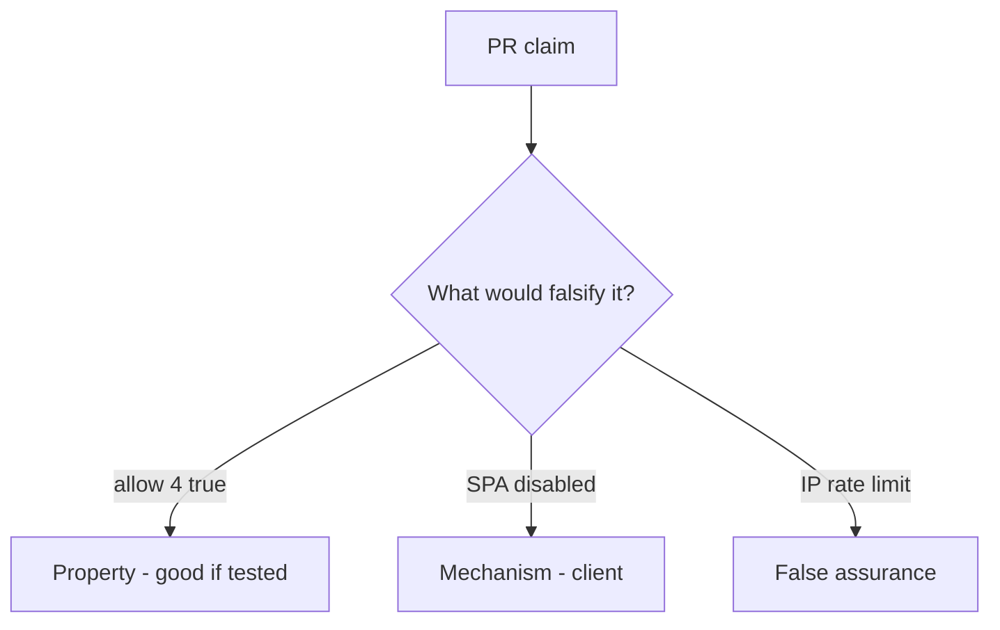

# 6.7-LO-08 — Review unbounded allow as a PR, not an API4 ticket

**Kind:** code-review
**Loop step:** Review
**Standards:** OWASP ASVS 5.0.0 (final) `v5.0.0-2.4.1`.

## Review the fixture as if it were SecureCollab export

Review `labs/6.7/6.7-lab/vulnerable/` as a SecureCollab PR. Intended findings live only in `content/assessment/keys/6.7.md` — not here.

## Mental model: No cap (allow always true)

Start with this seeded smell: **No cap (`allow` always true)**. Label it property, mechanism, or false assurance before you accept the PR.

Seeded smells (label them yourself; do not open the keys file):

- No cap (`allow` always true)
- Limit only in the frontend
- Global IP limit
- No test that the fourth is denied

Also reject: public load tests, keys in lessons.

## Misconceptions

- Availability is ops not appsec
- Captcha replaces quotas
- Autoscaling is the control

## Practice

Write three review notes. Tie at least one to `test_fourth_export_is_denied`.

## Transfer

Clinic PR that “rate-limited at nginx” without a per-subject fourth-export test is incomplete.
