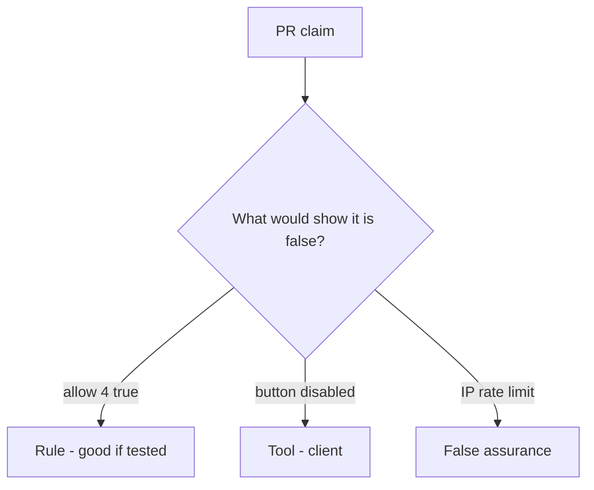

# Review of unbounded allow

**Kind:** code-review
**Loop step:** Review

The answers are not on this page. Do not open the keys file until someone has looked at your review.

## What you are reviewing

A colleague ships notes-app export. Your job is to label each claim **rule**, **tool**, or **false assurance**, and to say whether `allow(4)` is still true if they ship. Start at unbounded allow, not at a famous API-abuse list.

The folder `labs/6.7/6.7-lab/vulnerable/` is the change. The check you already ran (`test_fourth_export_is_denied`) is the rule test. A comment “will cap later” is not.

## Picture: problems to find (name them yourself)

Look at this first: **No cap (`allow` always true)**. Label it rule, tool, or false assurance before you accept the change.

Keep this: fourth denied. If that call never includes a server `n <= 3`, that unbounded path is still open. An IP bucket at the edge without that check is still the same problem.

A disabled button in the browser (the leftover 3.4 already named for shares) does not bind `allow(4)`. GraphQL aliases (7.1) are another budget path — name them, do not skip `test_fourth_export_is_denied`.

## Problems to find (name them yourself)

- No cap (`allow` always true)
- Limit only in the frontend
- Global IP limit
- No test that the fourth is denied

Also reject: public load tests; closing findings without re-running `test_fourth_export_is_denied`; keys in learner notes; an edge-proxy screenshot as the rule.

## Common mix-ups

- Availability is ops, not app work
- CAPTCHA replaces quotas
- Autoscaling is the control
- A famous API-abuse list is the rule
- HTTP 429 from an edge proxy is this check

## Practice

Write three review notes a maintainer could act on. Each note: what you saw, rule or false assurance, suggested structural change, leftover you will **not** delete. Tie at least one note to `test_fourth_export_is_denied`. Do not open the keys file.

## Use it somewhere new

Clinic change that “rate-limited at the edge” without a per-person fourth-export test is an incomplete review of unbounded allow. Name the independent falsehood that would still keep `allow(4)` false.

## What this page is not doing

Do not merge by adding a comment “will cap later.” That comment is leftover without an owner. Do not load-test a public host to prove the finding.
