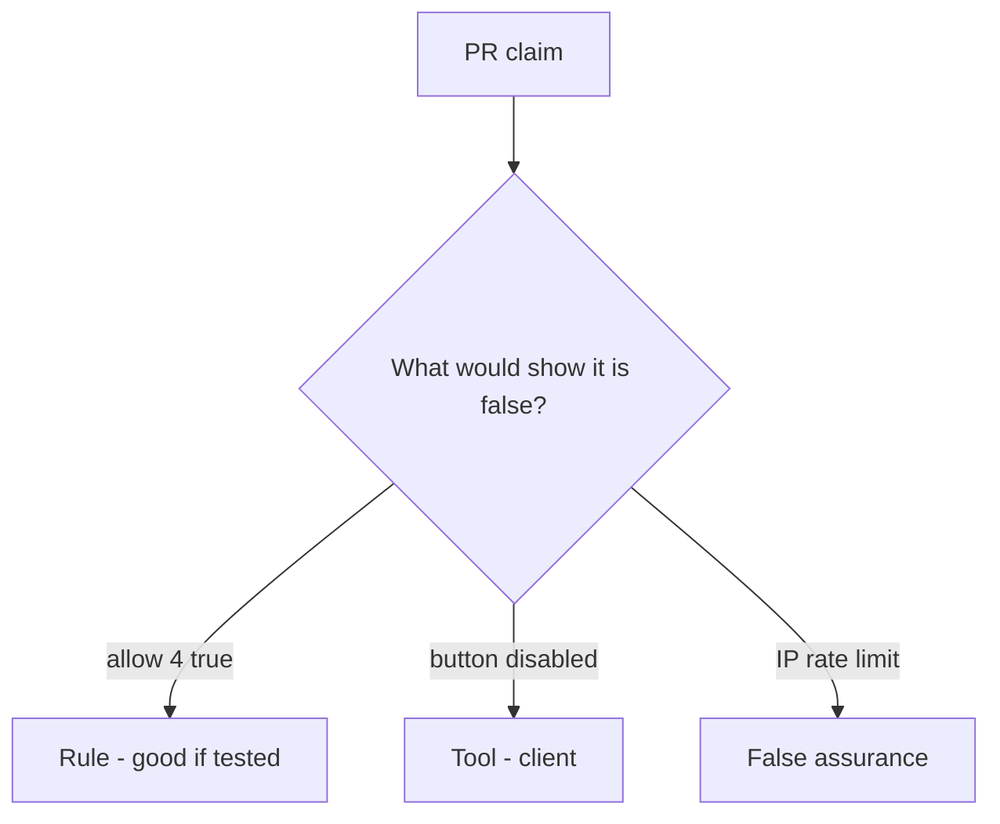

# Review of unbounded allow

**Kind:** code-review
**Loop step:** Review

## What you are reviewing

Export review starts at unbounded allow. Classify each claim as **rule**, **tool**, or **false assurance**, and say whether `allow(4)` is still true if they ship. A famous API-abuse list is not the fourth-export deny.

A TODO to cap later does not satisfy `test_fourth_export_is_denied`.

## Picture: problems to find (name them yourself)

**No cap (`allow` always true)**.

The fourth still has to be denied. If the change never checks a server `n <= 3`, that unbounded path is still open. An IP bucket at the edge without that check is still the same problem.

A disabled button in the browser (the leftover 3.4 already named for shares) does not bind `allow(4)`. GraphQL aliases (7.1) are another budget path — name them, do not skip `test_fourth_export_is_denied`.

## Problems to find (name them yourself)

- No cap (`allow` always true)
- Limit only in the frontend
- Global IP limit
- No test that the fourth is denied

Also reject: public load tests; closing findings without re-running `test_fourth_export_is_denied`; keys in learner notes; an edge-proxy screenshot as the rule.

## Common mix-ups

- Availability is ops, not app work
- CAPTCHA replaces quotas
- Autoscaling is the control
- A famous API-abuse list is the rule
- HTTP 429 from an edge proxy is this check

## Use it somewhere new

Clinic change that “rate-limited at the edge” without a per-person fourth-export test is an incomplete review of unbounded allow. What still has to deny so `allow(4)` is false after an edge rate limit?

## What this page is not doing

Leave “will cap later” out of the merge until someone owns the fourth-export deny. Do not load-test a public host to prove the finding.
