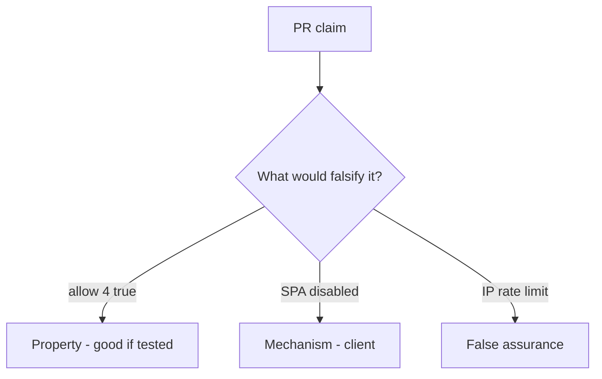

# 6.7-LO-08 — Review unbounded allow as a PR, not an API4 ticket

**Kind:** code-review
**Loop step:** Review
**Standards:** OWASP ASVS 5.0.0 (final) `v5.0.0-2.4.1`.

## Review the fixture as if it were SecureCollab export

Review `labs/6.7/6.7-lab/vulnerable/` as a SecureCollab PR. Your job is not to count suspicious lines. Reconstruct whether `allow(4)` is still true, compare that with the module invariant, and write changes a developer can verify.

Intended findings live only in `content/assessment/keys/6.7.md` — not here. Do not open the keys file until your review has been evaluated.

## Mental model: No cap (allow always true)

Start with this seeded smell: **No cap (`allow` always true)**. Label it property, mechanism, or false assurance before you accept the PR.

Classification starts at the protected effect (fourth denied). Everything that is not a server `n <= 3` at that call is a candidate unbounded path. An nginx IP bucket without that pytest is the same smell, not a different finding class.

A disabled SPA button (3.4’s client residual) does not bind `allow(4)`. GraphQL aliases (7.1) are another budget path — name them, do not skip `test_fourth_export_is_denied`.

## Seeded smells (label them yourself)

- No cap (`allow` always true)
- Limit only in the frontend
- Global IP limit
- No test that the fourth is denied

Also reject: public load tests; closing findings without re-running `test_fourth_export_is_denied`; keys in lessons.

## Misconceptions this module refuses

- Availability is ops not appsec
- Captcha replaces quotas
- Autoscaling is the control
- API4 is the property
- HTTP 429 from nginx is this cell

## Practice

Write three review notes a maintainer could act on. Each note: observation, property or false assurance, suggested structural change, residual you will **not** delete. Tie at least one to `test_fourth_export_is_denied`.

## Transfer

Clinic PR that “rate-limited at nginx” without a per-subject fourth-export test is an incomplete mediation review. Name the independent falsehood that would still keep `allow(4)` false.

## Non-goals

Do not merge by adding a comment “will cap later.” That comment is a residual without an owner. Do not load-test a public host to prove the finding.
