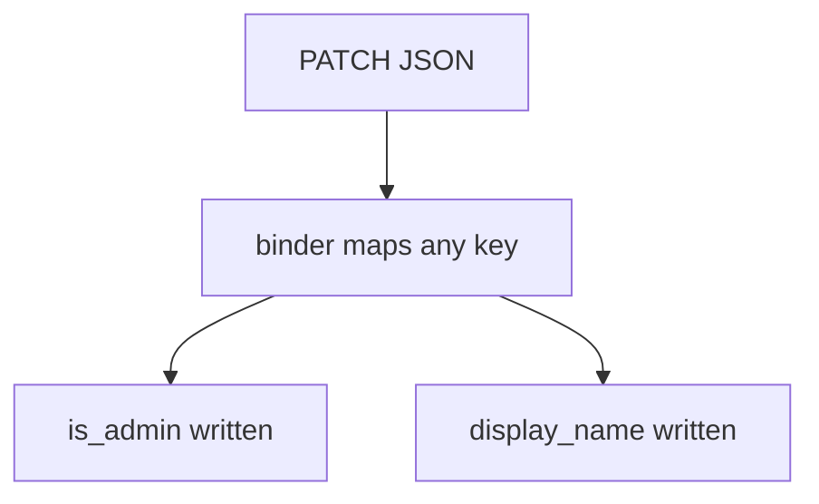
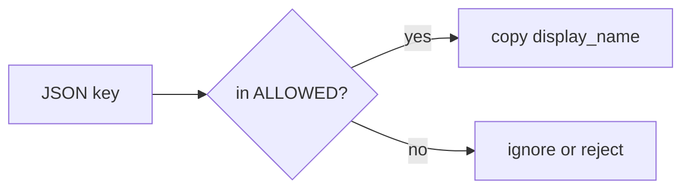

# Extra keys are not writable fields

**Kind:** concept-model
**Loop step:** 1 Property

## The rule

The notes app lets a member change their profile. The JSON document is **data**. `is_admin`, company id, and billing flags are **not** in the writable set. Last topic (1.2) said who-is-allowed is a rule. The grain is **which keys that rule may write**. Extra keys are not writable fields.

> After `apply(user, {"is_admin": true})`, `is_admin` must still be false. An honest `display_name` may change.

What must not happen: **a client change sets `is_admin`**. That is authorization of properties, not “missing login.”

Allowed fields have to be limited per action. Turning GraphQL schema listing off in production (unless the API is meant for other parties) is an **inventory** problem. GraphQL query cost is a **different rule** (6.7), not extra change arguments. Unused HTTP methods are leftover, later, and **advanced**. A famous-bugs nickname for extra fields or leftover endpoints is awareness after the cause, not the allow-list. An OpenAPI file is inventory, not the body filter.

## Picture: the binder maps any key



Pydantic allowing extra fields, FastAPI models that dump into database rows, and `user.update(body)` are the same shape: the binder treats the client document as a column map.

## Picture: the contract is the writable set



OpenAPI can *describe* the contract. It does not *enforce* the drop. A generated spec that is out of date is an inventory hole, not a substitute for the allow-list.

Swagger, a typed GraphQL schema, and a v2 bump do not drop `is_admin` from a PATCH.

## Why it happens, what it costs, how you stop it, how you notice, how you recover

| Slice | For this rule |
|---|---|
| Why it happens | Binder maps any key onto the row |
| What's already wrong | `apply(..., {"is_admin": true})` succeeds |
| Trigger | A signed-in member sends extra keys |
| What it costs | Privilege lift; company or billing mutation |
| How you stop it | Per-action writable set; ignore or reject extras |
| How you notice | `unknown_field_rejected`; `shadow_endpoint_scan` |
| How you recover | Demote the flag; audit who wrote it |

## What the framework does vs what you still have to check

FastAPI will bind extra fields if the model allows it. GraphQL will accept mutation arguments that the schema names — and will still honor extras if you pass a generic `input: JSON`. gRPC unknown fields are a third binder. None of those defaults is 1.2.

`apply`, extra keys are not writable fields — files in `labs/7.1/7.1-lab`. It is local only. It is not a live API.

## What the tool cannot do

- The allow-list must be restated for REST, GraphQL, and gRPC — one OpenAPI file does not cover the others.
- CSV import, admin BFF, and 7.4 job payloads are additional binders.
- Unused HTTP methods can still hit a leftover handler (leftover, later, advanced).
- GraphQL query cost can exhaust budget even when extras are dropped (6.7).

## Can people still use it

Rejecting extras must still let the member change `display_name`. Error text should say the field is not writable, not dump the whole document.

## Practice

Inventory endpoints. Mark each field writable by which role. Then run:

```text
python3 -m pytest labs/7.1/7.1-lab/tests --impl vulnerable
python3 -m pytest labs/7.1/7.1-lab/tests --impl fixed
```

## Use it somewhere new

Clinic change `{is_staff:true}`. GraphQL mutation arguments. gRPC unknown fields.

## What this page is not doing

Do not use live public-API attacks, dumping Pydantic source into notes. Opening this page does not finish a check-in. Answer keys are not on this site.
