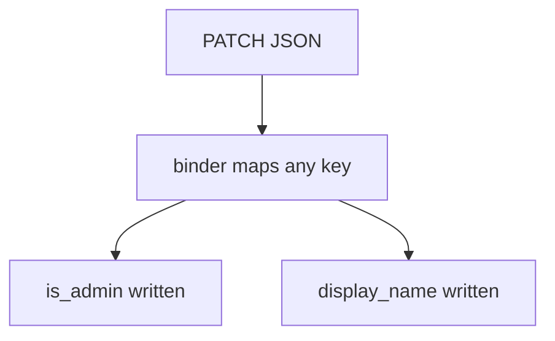
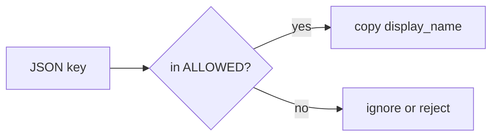

# 7.1-LO-01 — Extra keys are not writable fields

**Kind:** concept-model
**Loop step:** 1 Property
**Standards:** OWASP ASVS 5.0.0 (final) `v5.0.0-15.3.3`, `v5.0.0-4.3.2`, `v5.0.0-4.3.1`; `v5.0.0-4.1.4` is **Level 3, advanced**. OpenAPI 3.1.1 is inventory, not this sentence. API8/API9 are *awareness after* the cause.

## The claim this module owns

SecureCollab Phase 1 lets a member PATCH their profile. The JSON document is **data**. `is_admin`, tenant id, and billing flags are **not** in the writable set. Module 1.2 already said authority is a cell; this module’s grain is **which keys that cell may write**.

> After `apply(user, {"is_admin": true})`, `is_admin` must still be false. Honest `display_name` may change.

The forbidden outcome is **Client PATCH sets `is_admin`**. That is authorization of properties, not “missing login.”

ASVS `v5.0.0-15.3.3` wants allowed fields limited per controller and action. `v5.0.0-4.3.2` wants GraphQL introspection off in production unless the API is meant for other parties (schema leakage is an **inventory** problem). `v5.0.0-4.3.1` wants query allow-lists, depth, or cost analysis — that is **6.7’s resource-account grain**, not extra mutation args. `v5.0.0-4.1.4` (unused HTTP methods) is **Level 3, advanced**.

## Mental model: the binder maps any key



Pydantic `extra='allow'`, FastAPI models that dump into ORM rows, and `user.update(body)` are the same shape: the binder treats the client document as a column map.

## Mental model: contract writable set versus extra



OpenAPI can *document* the contract. It does not *enforce* the drop. A generated spec that is out of date is an inventory hole (API9 as awareness), not a substitute for the allow-list.

**Mechanism (not the property):** “we have Swagger,” “GraphQL is typed,” “we versioned to v2.”

## Root cause vs impact vs prevention vs detection vs recovery

| Slice | For this property |
|---|---|
| Root cause | Binder maps any key onto the entity |
| Preconditions | `apply(..., {"is_admin": true})` succeeds |
| Trigger | Authenticated member sends extra keys |
| Impact | Privilege lift; tenant or billing mutation |
| Prevention | Per-action writable set; ignore or reject extras |
| Detection | `unknown_field_rejected`; `shadow_endpoint_scan` |
| Recovery | Demote the flag; audit who wrote it |

## Framework defaults versus the contract guarantee

FastAPI will bind extra fields if the model allows it. GraphQL will accept mutation arguments that the schema names — and will still honor extras if you pass a generic `input: JSON`. gRPC unknown fields are a third binder. None of those defaults is 1.2.

## Mechanism limits

- The allow-list must be restated for REST, GraphQL, and gRPC — one OpenAPI file does not cover the others.
- CSV import, admin BFF, and 7.4 job payloads are additional binders.
- Unused HTTP methods (`v5.0.0-4.1.4`, Level 3) can still hit a leftover handler.
- GraphQL query cost (`v5.0.0-4.3.1`) can exhaust budget even when extras are dropped.

## Usability and accessibility

Rejecting extras must still let the member change `display_name`. Error text should say the field is not writable (WCAG 2.2 4.1.3), not dump the whole document.

## Practice

Inventory endpoints. Mark each field writable by which role. Then run:

```
python3 -m pytest labs/7.1/7.1-lab/tests --impl vulnerable
python3 -m pytest labs/7.1/7.1-lab/tests --impl fixed
```

The first command must fail. The second must pass.

## Transfer

Clinic PATCH `{is_staff:true}`. GraphQL mutation arguments. gRPC unknown fields.

## Non-goals

Live public-API attacks, dumping Pydantic source into notes. Gates 0–10 and milestones M0–M5 stay **not-attempted**. Answer keys are not in this file.
