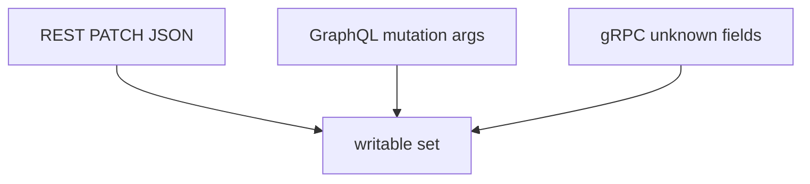
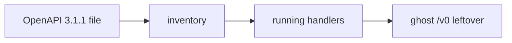

# 7.1-LO-02 — Binder maps any key; the contract is the writable set

**Kind:** design-exercise
**Loop step:** 2 Model
**Standards:** OWASP ASVS 5.0.0 (final) `v5.0.0-15.3.3`, `v5.0.0-4.3.2`. OpenAPI 3.1.1 is inventory.

## Can a second engineer name pytest cases from your writable-field map?

“We published OpenAPI” is not this lesson. A reviewable model names **the action, the writable keys, and every protocol that binds a document**.

SecureCollab Phase 1 freeze: local `apply(user, body)` with `ALLOWED = {display_name}`. No live APIs.

## Mental model: three binders, one contract

If REST is allow-listed and GraphQL `updateUser(input: JSON)` is not, the contract has a hole. Introspection (`v5.0.0-4.3.2`) leaking the schema is how an attacker *finds* extra args; it is not the write itself.

## Mental model: inventory of every protocol

A spec that does not match running code is API9 as awareness. Versioning the path to `/v2` without retiring `/v0` is not a security control.

## Step 1: freeze pieces

| Piece | This system |
|---|---|
| Subjects | authenticated member; leftover `/v0` client |
| Objects | `display_name`, `is_admin` |
| Actions | `apply` / PATCH |
| Channels | JSON PATCH; later GraphQL and protobuf |
| TCB | server-side `ALLOWED` |
| Untrusted | JSON keys; generated clients; GraphQL variables |
| State / time | one PATCH; leftover undocumented route |
| 1.1 cell | authorization of properties |

## Step 2: write cells

| Subject | Object | Action | Decision |
|---|---|---|---|
| member | `display_name` | PATCH | allow |
| member | `is_admin` | PATCH | deny |
| member | unknown key | PATCH | ignore or reject |
| OpenAPI comment | any | document | not TCB |
| leftover `/v0` | any | call | inventory then deny |

## Practice

Draw the matrix. Point at `labs/7.1/7.1-lab` file `patch.py`.

## Transfer

GraphQL `updatePatient(isStaff: true)`; protobuf field numbers not in the writable set.

## Residual risk

Honest `display_name` XSS (6.2). GraphQL cost (`v5.0.0-4.3.1` / 6.7). Unused methods (`v5.0.0-4.1.4`, Level 3). 7.2 field *reads*. 7.4 job payloads.

## Non-goals

Top 10 as the definition of security. Keys stay out of lessons.
